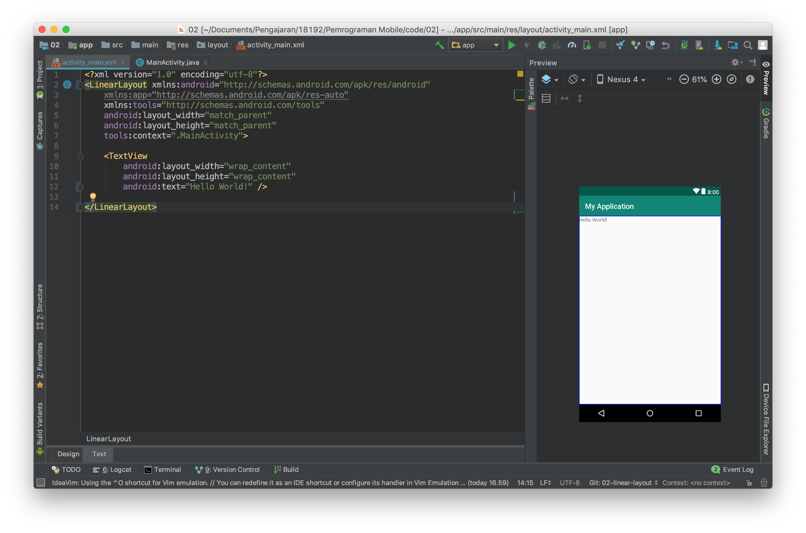
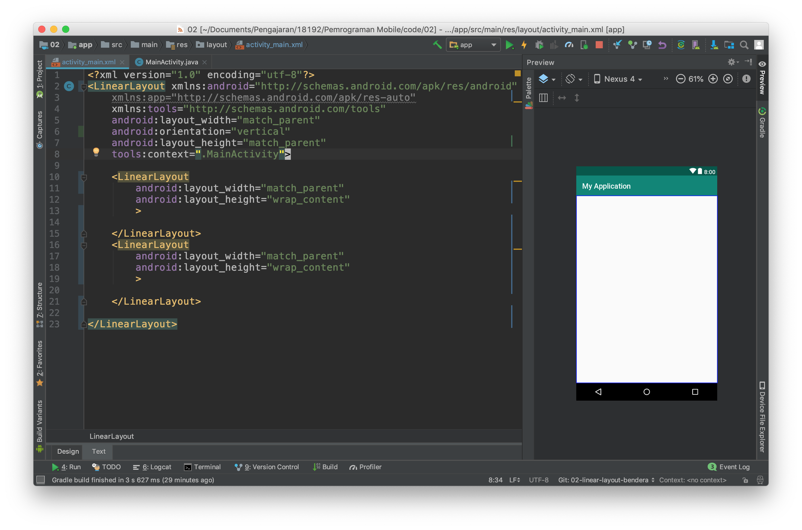

# Activity Lifecycle dan Layout

## Kemampuan akhir yang diharapkan

Setelah melakukan praktikum ini mahasiswa mampu :

1. Membuat Aplikasi Android "Hello World" yang menggunakan callback Activity Lifecycle.
2. Membuat aplikasi dengan linear layout
3. Membuat aplikasi dengan relative layout
4. Membuat aplikasi dengan constraint layout

### Membuat aplikasi hello world yang menggunakan callback Activity Lifecycle

- Bukalah aplikasi Android Studio.
- Buatlah sebuah project baru dengan konfigurasi seperti pada gambar dibawah ini

  

  Nama aplikasi silahkan disesuaikan dengan keinginan anda, perhatikan ada warning mengenai path project, sebaiknya path project tidak memiliki spasi.

  
  Targetkan phone dan pilihlah minimum sdk sesuai kebutuhan, semakin tinggi minimum sdk semakin sedikit device yang dapat menggunakan aplikasi yang anda buat.
  
  Pilihlah empty activity sebagai template starter project anda.
  

* Bukalah file MainActivity.java

  
  

* Tambahkan Override untuk callback pada event activity lifecycle.

| Activity Method | Deskripsi                                                                                                                                                                      | Next                      |
| --------------- | ------------------------------------------------------------------------------------------------------------------------------------------------------------------------------ | ------------------------- |
| onCreate()      | Ketika sebuah activity dibuat, pada method ini dilakukan inisialisasi seperti create view, list data, dll.                                                                     | onStart()                 |
| onRestart()     | Ketika sebuah activity dihentikan, dan merupakan prioritas untuk memanggil activity itu kembali.                                                                               | onStart()                 |
| onStart()       | Ketika sebuah activity dipanggil sebelum diperlihatkan ke user.                                                                                                                | onResume() / onStop()     |
| onResume()      | Ketika sebuah activity start/mulai melakukan interaksi dengan user, pada saat ini activity berada pada posisi teratas dari activity stack yang mana user akan melakukan input. | onPause()                 |
| onPause()       | Ketika sebuah activity lainnya dipanggil/dimulai, method ini digunakan ketika data tidak harus disimpan ke dalam sistem secara permanen.                                       | onResume() / onStop()     |
| onStop()        | Ketika sebuah acivity tidak lagi dibutuhkan/tidak terlihat lagi oleh user.                                                                                                     | onRestart() / onDestroy() |
| onDestroy()     | Ketika sebuah activity secara permanen tidak lagi dibutuhkan (activity dihancurkan). Dapat juga dilakukan dengan fungsi finish() / isFinishing().                              | -                         |

* Tambahkan Toast untuk masing masing event

### Verifikasi Hasil Percobaan

Lakukan kompilasi program ke device android anda kemudian perhatikan apa yang terjadi di aplikasi tersebut.

### Membuat aplikasi dengan linear layout

- Buatlah kembali sebuah project baru dengan konfigurasi yang disesuaikan dengan kebutuhan anda seperti pada langkah praktikum sebelumnya.
- Bukalah file `activity_main.xml` kemudian buka dengan menggunakan design mode.

- Kemudian lakukan konversi view dari constraint layout ke lineear layout.

- Kemudian gantilah design mode ke text mode. 

- Tambahkan properties `android:orientation="vertical"` pada tag `LinearLayout`

Anda baru saja menambahkan atrribut baru pada tag xml, ada banyak properties lain yang perlu anda ketahui silahkan melakukan explorasi untuk properties atribut lain.

- Selanjutnya tambahkan properties background pada linear layout seperti pada gambar dibawah ini sehingga layout anda berubah background nya menjadi hijau.

- Kemudian ubahlah nilai dari properties `layout_height` menjadi wrap_content

- Lakukanlah kompilasi kemudian simpulkan apakah perbedaan antara `wrap_content` dan `match_parent`

Selain properties diatas linear layout mempunyai properties khusus yang hanya ada pada tipe layout ini, yaitu `weigth_sum` dan `layout_weight`

- weight_sum adalah bobot yang diberikan kepada LinearLayout bobot ini nantinya dapat digunakan untuk membagi ukuran yang dapat dimiliki oleh child dari LinearLayout.
- layout_weight adalah bobot yang diberikan kepada child dari LinearLayout untuk menentukan ukuran dari child ini pada layar.

Untuk memahami penggunaannya lakukan langkah percobaaan berikut ini :

- Buka kembali project sebelumnya, kemudian kembalikan `layout_height` ke `match_parent`, juga hapus properties background seperti pada gambar dibawah ini :

- Hapuslah tag xml TextView kemudian isilah LinearLayout dengan dua buah child lain yang juga sebuah LinearLayout hasilnya seperti pada gambar dibawah ini.

- Jika anda lihat belum terjadi perubahan apapun pada layout, untuk itu lanjutkan dengan menambahkan properties background, weight_sum dan layout_weight seperti pada gambar dibawah ini.

> kita dapat menggunakan LinearLayout sebagai child dari LinearLayout atau layout lain proses ini dinamakan nested layout

- Berdasarkan percobaan diatas lakukan lah perubahan perubahan sebagai berikut kemudian ambil lah kesimpulan dari percobaan ini.
  - ubah orientasi menjadi horizontal
  - ubah weight sum menjadi angka integer yang lain
  - ubah layout_weight dari salah satu LinearLayout
  
### Membuat aplikasi dengan relative layout
- Selanjutnya untuk memahami relative layout kembalikan kode program pada activity_main.xml ke kondisi awal dan ubah lah layout nya menjadi relative layout. Sehingga kode program dan tampilan berubah seperti gambar dibawah ini.
  

 > RelativeLayout adalah layout yang menempatkan suatu item relative terhadap parent atau item lain pada UI.

 - Untuk mencoba nya tambahkan dua buah button pada layout anda bisa menambahkan dengan menggunakan pallet yang ada di sebelah kiri tampilan design kemudan jangan lupa menghapus TextView "hello world"

- Ubahlah teks dan lebar dari button sehingga menjadi seperti gambar dibawah ini.

> untuk mengubah bisa menggunakan text mode atau pada design mode dengan mengklik button dan mengganti properties di kanan editor.

- Selanjutnya ubahlah tampilan dengan mengubah kode program melalui text mode sehingga seperti gambar dibawah ini.

Perhatikan pada kode program tersebut sebuah item di posisikan pada layout dengan memberikan detail posisinya relative terhadap parent. 

Pada button pertama button ini mempunyai properties         android:layout_alignParentStart="true" android:layout_alignParentLeft="true" android:layout_alignParentTop="true" 

Dengan konfigurasi properties seperti diatas sebuah item akan diposisikan di sebelah kiri atas.

- untuk lebih memahami relative layout buatlah layout baru seperti pada gambar dibawah ini.

- Berdasarkan percobaan diatas cobalah membuat layout yang sebelumnya menggunakan linear layout dengan relative layout.

### Membuat aplikasi dengan constraint layout

Constraint layout merupakan layout terbaru dari android, layout ini berbasis relative layout namun mempunyai tingkat kemudahan yang lebih baik dalam penggunaannya.

Penggunaan Constraint layout ini mirip dengan relative layout namun dengan kemudahan dalam mengoperasikannya karena sudah dapat digunakan dengan baik pada editor di design mode.

Setiap item pada constraint layout memiliki 4 arah constraint yaitu top, left, right, dan bottom. Ke empat arah ini terdapat sebuah connection source yang dapat di tarik ke parent atau ke objek lain. Perhatikan gambar dibawah ini.

Pada text view hello world terdapat 4 constraint dan masing masing constraint di hubungkan ke parent dengan mode panah bergerigi, panah bergerigi ini mewakili `wrap_content` pilihan lain selain wrap content adalah fixed dan match constraint. Silahkan mencoba dan berikan kesimpulan terhadap pengamatan dan percobaan ada mengenai hal ini.

- untuk mencoba silahkan kembalikan kode program pada `activity_main.xml` ke kondisi awal.
- Kemudian buatlah layout pada latihan LinearLayout menggunakan ConstraintLayout
  > Untuk membagi layout menjadi dua bagian gunakan guidelines
- Selanjutnya buatlah layout pada latihan RelativeLayout menggunakan ConstraintLayout
  > Untuk membuat ini lebih cepat menggunakan design mode dan menarik constraint ke parent atau object lain

## Kesimpulan

## Latihan Praktikum
- Buatlah layout android seperti pada gambar dibawah ini menggunakan 3 tipe layout yaitu linear layout, relative layout dan constraint layot.

Bahan bahan tutorial yang diperlukan untuk menyelesaikan tugas ini : 
- https://stackoverflow.com/questions/19189265/custom-designing-edittext
- https://www.codeproject.com/Tips/845894/How-to-make-EditText-With-Border-and-Gradient-Back
- https://stackoverflow.com/questions/49023249/custom-background-for-edittext-in-android?noredirect=1&lq=1
- https://stackoverflow.com/questions/27588965/how-to-use-custom-font-in-a-project-written-in-android-studio
- Font used : https://www.fontsquirrel.com/fonts/montserrat