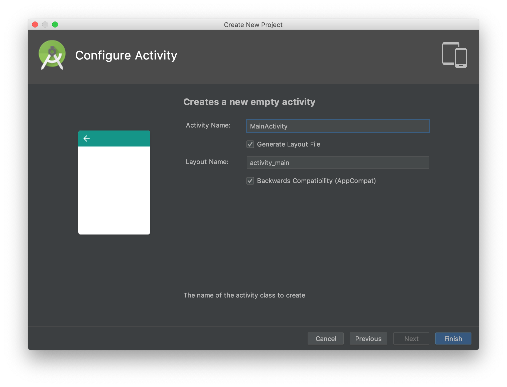
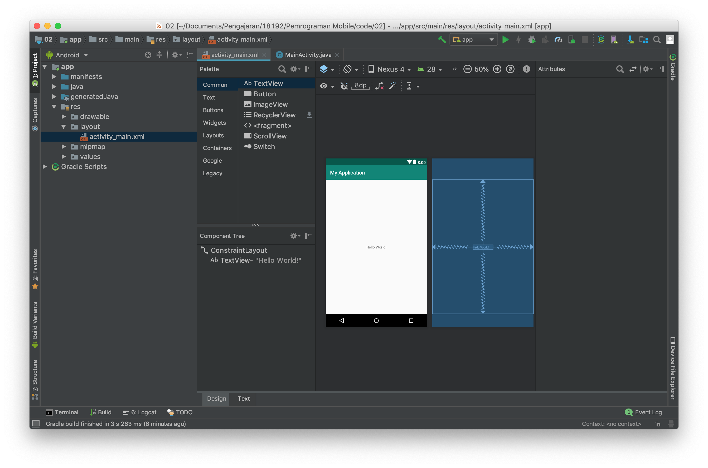

# Activity Lifecycle dan Layout

## Kemampuan akhir yang diharapkan

Setelah melakukan praktikum ini mahasiswa mampu :

1. Membuat Aplikasi Android "Hello World" yang menggunakan callback Activity Lifecycle.
2. Membuat aplikasi dengan linear layout
3. Membuat aplikasi dengan relative layout
4. Membuat aplikasi dengan constraint layout

## Membuat aplikasi hello world yang menggunakan callback Activity Lifecycle

- Bukalah aplikasi Android Studio.
- Buatlah sebuah project baru dengan konfigurasi seperti pada gambar dibawah ini

  

  Nama aplikasi silahkan disesuaikan dengan keinginan anda, perhatikan ada warning mengenai path project, sebaiknya path project tidak memiliki spasi.

  
  Targetkan phone dan pilihlah minimum sdk sesuai kebutuhan, semakin tinggi minimum sdk semakin sedikit device yang dapat menggunakan aplikasi yang anda buat.
  
  Pilihlah empty activity sebagai template starter project anda.
  

* Bukalah file MainActivity.java

  
  

* Tambahkan Override untuk callback pada event activity lifecycle.
* Tambahkan Toast untuk masing masing event

## Membuat aplikasi dengan linear layout

## Membuat aplikasi dengan relative layout

## Membuat aplikasi dengan constraint layout

## Kesimpulan

## Latihan Praktikum
