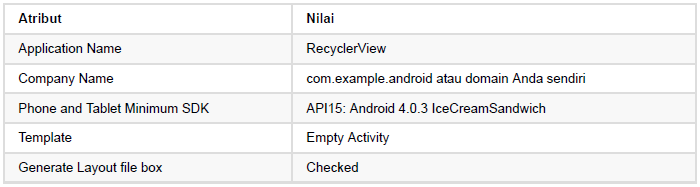
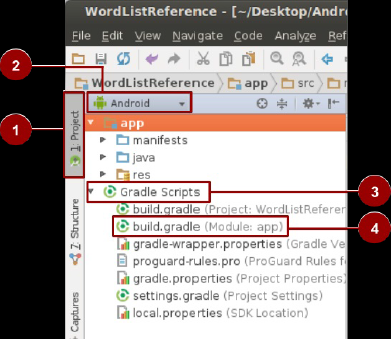
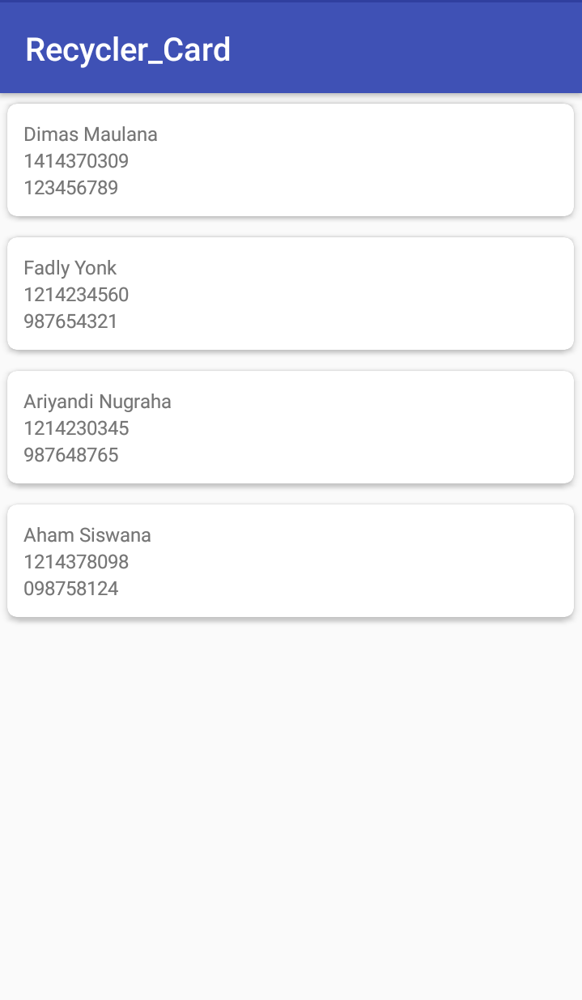

# RecyclerView

# Kemampuan Akhir Yang Diharapkan

Setelah melakukan praktikum ini mahasiswa mampu :
1. Mahasiswa mampu membuat aplikasi yang memiliki RecyclerView dengan berbagai macam datasource dan custom adapter.
2. Mahasiswa mampu memodifikasi RecyclerView yang dibuat sebelumnya dengan memanfaatkan layout manager.

### *Konsep :*

Perlu difahami terlebih dahulu terkait istilah dan fungsi dari 
*RecyclerView* dan *CardView*.

        RecyclerView :

dalam penggunaan sebuah aplikasi jika ingin menampilkan sebuah *data set* dalam jumlah yang relatif besar, ribuan — atau bahkan sampai jutaan. Maka ditulah seuah aplikasi memerlukan adanya sebuah view untuk dapat menghandle-nya. Sebelum adanya RecyclerView, dapat pula digunakan ListView untuk menhandle set data tersebut, namun masih ada beberapa kekurangan yang ada pada ListView. Sehingga muncullah RecyclerView dengan kemampuan yang lebih baik dari ListView,dengan kelebihannya cepat dan lebih efisien (terutama dalam menangani data berjumlah besar). Contoh real penggunaan RecyclerView adalah ada pada GMail.

Penjelasan secara lebih lengkap dapat merujuk pada tautan berikut :
https://developer.android.com/training/material/lists-cards.html

        CardView :

CardView adalah sebuah view paketan dari desain material yang diperkenalkan pada Android Versi Lolipop. Dalam penggunaannya view ini biasanya digunakan untuk membungkus data bentuk beberapa view atau sepaket data yang ditandai dengan sebuah tampilan view yang memiliki elevasi/*drop shadow* serta *corner radius*. Dimana CardView ini merupakan sebuah subclass dari Framelayout.

Selanjutnya, pada project ini akan di praktikan penggunaan RecyclerView pada aplikasi Android dengan mengkombinasikan penggunaan antara RecyclerView dan CardView dengan menggunakan *custom adapter*


# Membuat Aplikasi Android dengan menggunakan RecyclerView
Jalankan Android Studio dan buat project baru dengan parameter seperti berikut :



Jika sudah membuat sebuah project aplikasi Android baru di Android Studio, selanjutnya pada panel projrct [1] dan di tampilan Android [2] buka folder Gradle Script [3] kemudian buka file build.gradle [4] 
        


### Menambah Dependencies

Pertama, lakukan penambahan dependencies dalam gradle, kemudian lakukan *Sync Now*.
```java
dependencies {
    implementation fileTree(dir: 'libs', include: ['*.jar'])
    implementation 'com.android.support:appcompat-v7:28.0.0'
    implementation 'com.android.support.constraint:constraint-layout:1.1.3'
    testImplementation 'junit:junit:4.12'
    androidTestImplementation 'com.android.support.test:runner:1.0.2'
    androidTestImplementation 'com.android.support.test.espresso:espresso-core:3.0.2'

    implementation 'com.android.support:recyclerview-v7:28.0.0'
    implementation 'com.android.support:cardview-v7:28.0.0'
}
```

    jika terjadi error di sini, maka samakan support library version anda dengan
    compileSdkVersion anda. Lihat supportLibraryVersion
    <https://developer.android.com/topic/libraries/support-library/revisions>.


### Menambahkan RecyclerView pada layout

Selanjutnya tambahkan RecyclerView pada activity_main.xml :
```xml
<?xml version="1.0" encoding="utf-8"?>
<RelativeLayout xmlns:android="http://schemas.android.com/apk/res/android"
    xmlns:tools="http://schemas.android.com/tools"
    android:id="@+id/activity_main"
    android:layout_width="match_parent"
    android:layout_height="match_parent"
    tools:context=".MainActivity">

    <android.support.v7.widget.RecyclerView
        android:id="@+id/recycler_view"
        android:layout_width="match_parent"
        android:layout_height="match_parent"/>

</RelativeLayout>
```

### Membuat Model Class

Langkah berikutnya adalah membuat /model/ /class/. Pada praktik ini contohkan kelas mahasiswa yang berisi nama, npm, dan no hp.
```java
package app.andropath.com.recyclerviewexample;

public class Mahasiswa {

    private String nama;
    private String npm;
    private String nohp;

    public Mahasiswa(String nama, String npm, String nohp) {
        this.nama = nama;
        this.npm = npm;
        this.nohp = nohp;
    }

    public String getNama() {
        return nama;
    }

    public void setNama(String nama) {
        this.nama = nama;
    }

    public String getNpm() {
        return npm;
    }

    public void setNpm(String npm) {
        this.npm = npm;
    }

    public String getNohp() {
        return nohp;
    }

    public void setNohp(String nohp) {
        this.nohp = nohp;
    }
}
```
### Membuat layout list_itemnya

Selanjutnya anda buat layout untuk /view item/-nya. hal ini untuk mendeskripsikan apa saja element dalam baris list. Disinilah, selanjutnya akan diletakkan CardView-nya. Dalam praktikum ini kita ingin menampilkan nama, npm dan nohp dalam sebuah TextView :
```xml
<?xml version="1.0" encoding="utf-8"?>

<android.support.v7.widget.CardView xmlns:android="http://schemas.android.com/apk/res/android"
    xmlns:card_view="http://schemas.android.com/apk/res-auto"
    android:layout_width="match_parent"
    android:layout_height="wrap_content"
    card_view:cardCornerRadius="6dp"
    card_view:cardElevation="3dp"
    card_view:cardUseCompatPadding="true">

    <LinearLayout xmlns:android="http://schemas.android.com/apk/res/android"
        android:layout_width="match_parent"
        android:layout_height="wrap_content"
        android:layout_margin="5dp"
        android:orientation="vertical"
        android:padding="5dp">

        <!-- TextView Nama Mahasiwa -->
        <TextView
            android:id="@+id/txt_nama_mahasiswa"
            android:layout_width="match_parent"
            android:layout_height="wrap_content" />

        <!-- TextView Npm Mahasiswa -->
        <TextView
            android:id="@+id/txt_npm_mahasiswa"
            android:layout_width="match_parent"
            android:layout_height="wrap_content" />

        <!-- TextView NoHp Mahasiswa -->
        <TextView
            android:id="@+id/txt_nohp_mahasiswa"
            android:layout_width="match_parent"
            android:layout_height="wrap_content" />

    </LinearLayout>

</android.support.v7.widget.CardView>
```

### Membuat Adapter

Setelah itu, lakukan pembuatan adapternya untuk RecyclerView :
```java
package app.andropath.com.recyclerviewexample;

import android.support.v7.widget.RecyclerView;
import android.view.LayoutInflater;
import android.view.View;
import android.view.ViewGroup;
import android.widget.TextView;

import java.util.ArrayList;

public class MahasiswaAdapter extends RecyclerView.Adapter<MahasiswaAdapter.MahasiswaViewHolder> {


    private ArrayList<Mahasiswa> dataList;

    public MahasiswaAdapter(ArrayList<Mahasiswa> dataList) {
        this.dataList = dataList;
    }

    @Override
    public MahasiswaViewHolder onCreateViewHolder(ViewGroup parent, int viewType) {
        LayoutInflater layoutInflater = LayoutInflater.from(parent.getContext());
        View view = layoutInflater.inflate(R.layout.row_mahasiswa, parent, false);
        return new MahasiswaViewHolder(view);
    }

    @Override
    public void onBindViewHolder(MahasiswaViewHolder holder, int position) {
        holder.txtNama.setText(dataList.get(position).getNama());
        holder.txtNpm.setText(dataList.get(position).getNpm());
        holder.txtNoHp.setText(dataList.get(position).getNohp());
    }

    @Override
    public int getItemCount() {
        return (dataList != null) ? dataList.size() : 0;
    }

    public class MahasiswaViewHolder extends RecyclerView.ViewHolder{
        private TextView txtNama, txtNpm, txtNoHp;

        public MahasiswaViewHolder(View itemView) {
            super(itemView);
            txtNama = (TextView) itemView.findViewById(R.id.txt_nama_mahasiswa);
            txtNpm = (TextView) itemView.findViewById(R.id.txt_npm_mahasiswa);
            txtNoHp = (TextView) itemView.findViewById(R.id.txt_nohp_mahasiswa);
        }
    }
}
```

### Set Adapter ke RecyclerView dalam MainActivity

Langkah terakhir adalah lakukan set adapter ke /recyclerview/. Pada tahap ini masukkan 4 dummy data object Mahasiswa, yang dimasukkan kedalam ArrayList, untuk kemudian dilakukan passing ke adapternya :
```java
package app.andropath.com.recyclerviewexample;

import android.support.v7.app.AppCompatActivity;
import android.os.Bundle;
import android.support.v7.widget.LinearLayoutManager;
import android.support.v7.widget.RecyclerView;

import java.util.ArrayList;

public class MainActivity extends AppCompatActivity {

    private RecyclerView recyclerView;
    private MahasiswaAdapter adapter;
    private ArrayList<Mahasiswa> mahasiswaArrayList;

    @Override
    protected void onCreate(Bundle savedInstanceState) {
        super.onCreate(savedInstanceState);
        setContentView(R.layout.activity_main);

        addData();

        recyclerView = (RecyclerView) findViewById(R.id.recycler_view);

        adapter = new MahasiswaAdapter(mahasiswaArrayList);

        RecyclerView.LayoutManager layoutManager = new LinearLayoutManager(MainActivity.this);

        recyclerView.setLayoutManager(layoutManager);

        recyclerView.setAdapter(adapter);
    }

    void addData(){
        mahasiswaArrayList = new ArrayList<>();
        mahasiswaArrayList.add(new Mahasiswa("Dimas Maulana", "1414370309", "123456789"));
        mahasiswaArrayList.add(new Mahasiswa("Fadly Yonk", "1214234560", "987654321"));
        mahasiswaArrayList.add(new Mahasiswa("Ariyandi Nugraha", "1214230345", "987648765"));
        mahasiswaArrayList.add(new Mahasiswa("Aham Siswana", "1214378098", "098758124"));
    }

}
```

Jika tidak ada error , maka akan terlihat hasilnya seperti berikut :


