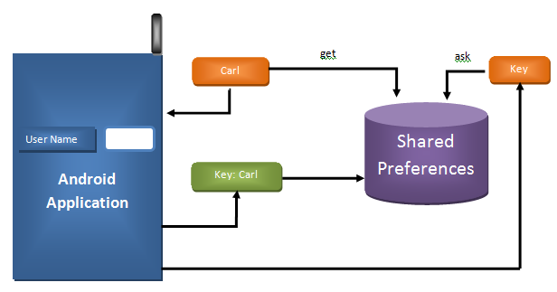
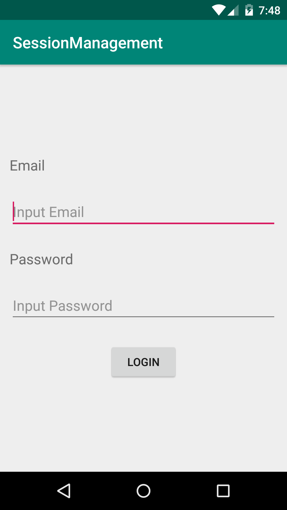
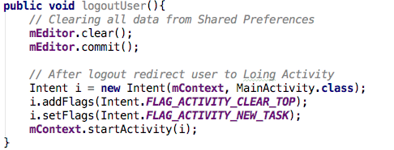

#Kemampuan Akhir Yang Direncanakan

- Mahasiswa mampu membuat aplikasi yang memiliki shared preference untuk mengubah konfigurasi aplikasi.
- Mahasiswa mampu membuat activity config untuk mengubah behavior aplikasi sesuai konfigurasi yang dipilih oleh user.

# Teori
Shared preferences berfungsi untuk menyimpan data yang kecil. Cara untuk menyimpan dan membaca data pada shared preferences menggunakan key-value. Shared preferences merupakan penyimpanan yang bersifat persistent. Berikut adalah ilustrasi dari shared preferences.


Gambar 1. Ilustrasi Shared Preferences

# Modul
Shared preferences untuk membuat session management user.
1. Buat project baru pada android studio dengan nama SessionManagement dan pastikan kalian memilih template template Empty Activity.
2. Setelah berhasil membuat project baru, tambahkan 1 Activity baru dengan nama **Main2Activity**. Jadi sekarang terdapat 2 Acticity di dalam project. Langkah selanjutnya adalah membuat tampilan MainActivity seperti berikut: 
  
Gambar 2. Tampilan Login  
```xml 
<?xml version="1.0" encoding="utf-8"?>
<LinearLayout xmlns:android="http://schemas.android.com/apk/res/android"
    xmlns:tools="http://schemas.android.com/tools"
    android:layout_width="match_parent"
    android:layout_height="match_parent"
    android:gravity="center_vertical"
    android:orientation="vertical"
    tools:context=".MainActivity">

    <TextView
        android:layout_width="wrap_content"
        android:layout_height="wrap_content"
        android:layout_margin="12dp"
        android:text="Email"
        android:textSize="18sp" />

    <EditText
        android:id="@+id/editEmail"
        android:layout_width="match_parent"
        android:layout_height="wrap_content"
        android:layout_margin="12dp"
        android:hint="Input Email"
        android:inputType="textEmailAddress" />

    <TextView
        android:layout_width="match_parent"
        android:layout_height="wrap_content"
        android:layout_margin="12dp"
        android:text="Password"
        android:textSize="18sp" />

    <EditText
        android:id="@+id/editPassword"
        android:layout_width="match_parent"
        android:layout_height="wrap_content"
        android:layout_margin="12dp"
        android:hint="Input Password"
        android:inputType="textPassword" />

    <Button
        android:id="@+id/buttonLogin"
        android:layout_width="wrap_content"
        android:layout_height="wrap_content"
        android:layout_gravity="center_horizontal"
        android:layout_margin="12dp"
        android:text="Login" />
</LinearLayout>
```  
3. Setelah membuat tampilan seperti pada Gambar 2, langkah selanjutnya adalah  menggunakan layout widget yang telah kita buat pada tampilan dengan cara, membuat instansiasi dari EditText dan Button:  
```java
EditText edtEmail, edtPassword;
Button buttonLogin;
```  
Dan pada onCreate definisikan widget tersebut dengan cara menambahkan source code berikut:  
```java
edtEmail     = findViewById(R.id.editEmail);
edtPassword  = findViewById(R.id.editPassword);
buttonLogin  = findViewById(R.id.buttonLogin);
```  
4. Selanjutnya kita gunakan shared preferences pada Activity yang ada didalam project,dengan cara membuat class java dengan nama SessionManagement.java    
```java
public class SessionManagement {
    //Share preference
    private SharedPreferences mSharedPreference;
    //Editor for Shared preference
    private SharedPreferences.Editor mEditor;
    //context
    private Context mContext;
    //Shared pref mode
    int PRIVATE_MODE;
    //Shared pref name
    private static final String PREF_NAME = "SharedPrefLatihan";
    //Shared Preferences Keys
    private static final String IS_LOGIN = "IsLoggedIn";
    public static final String KEY_EMAIL = "email";
    public static final String KEY_PASSWOrD = "email";

    public SessionManagement(Context mContext) {
        this.mContext = mContext;
        mSharedPreference = this.mContext.getSharedPreferences(PREF_NAME,
                PRIVATE_MODE);
        mEditor = mSharedPreference.edit();
    }
}
```     
Gambar 3. SharedPreference.java   
5. Pada class SessionManagement tambahkan method untuk menyimpan shared preferences dengan nama createLoginSession.
```java
public void createLoginSession(String email, String password){
        // Storing login value as TRUE
        mEditor.putBoolean(IS_LOGIN, true);
        // Storing email
        mEditor.putString(KEY_EMAIL, password);
        // Storing password
        mEditor.putString(KEY_PASSWOrD, email);
        mEditor.commit();
    }
```     
Gambar 4. createLoginSession   
6. Selanjutnya pada class SessionManagement, tambahkan method getUserInformation untuk mendapatakan informasi user.   
```java
    public HashMap<String, String> getUserInformation(){
        HashMap<String, String> user = new HashMap<String, String>();
        // user email
        user.put(KEY_EMAIL, mSharedPreference.getString(KEY_EMAIL, null));
        // user password
        user.put(KEY_PASSWOrD, mSharedPreference.getString(KEY_PASSWOrD, null));
        // return user
        return user;
    }     
```     
Gambar 5. Method getUserInformation   
7. Selanjutnya kita tambahkan method untuk mengecek apakah user sudah login atau belum dengan menambahkan method checkIsLogin pada class SessionManagement.   
```java
    public boolean isLoggedIn(){
        return mSharedPreference.getBoolean(IS_LOGIN, false);
    }

    public void checkIsLogin() {
        // Check login status
        if (!isLoggedIn()) {
            // user is not logged in redirect to MainActivity
            Intent i = new Intent(mContext, MainActivity.class);

            // Closing all the Activities
            i.addFlags(Intent.FLAG_ACTIVITY_CLEAR_TOP);

            // Add new Flag to start new Activity
            i.setFlags(Intent.FLAG_ACTIVITY_NEW_TASK);
            mContext.startActivity(i);
        }
    }
```   
Gambar 6. Method checkLoginStatus       
8. Method terakhir yang ditambahkan pada SessionManagement.java adalah method logoutUser(). Method ini berfungsi untuk menghapus Shared Preference yang telah disimpan.
    
Gambar 7. Method checkLoginStatus       
9. Setelah membuat layout untuk aplikasi dan membuat class SessionManagement, selanjutnya gunakan class SessionManagement pada Activity. Dengan cara seperti berikut:   
```java 
    public void logoutUser(){
        // Clearing all data from Shared Preferences
        mEditor.clear();
        mEditor.commit();

        // After logout redirect user to Loing Activity
        Intent i = new Intent(mContext, MainActivity.class);
        i.addFlags(Intent.FLAG_ACTIVITY_CLEAR_TOP);
        i.setFlags(Intent.FLAG_ACTIVITY_NEW_TASK);
        mContext.startActivity(i);
    }
```   
Gambar 8. Method logoutUser   
10. Selanjutnya handle event ketika button di click.
```java
    if(sessionManagement.isLoggedIn()){
        goToActivity();
    }

    buttonLogin.setOnClickListener(new View.OnClickListener() {
        @Override
        public void onClick(View view) {
            
            sessionManagement.createLoginSession(edtEmail.getText().toString(), edtPassword.getText().toString());
            goToActivity();
        }
    });
    private void goToActivity(){
        Intent mIntent = new Intent(getApplicationContext(), Main2Activity.class);
        startActivity(mIntent);
    }
```    
Gambar 9. Handle Click Event   

Sampai tahap ini kita sudah mengimplementasikan shared preference untuk membuat session pada aplikasi android. Jika kita melakukan login kemudian kita menutup aplikasi yang telah kita buat, maka session akan tetap ada sehingga aplikasi secara otomatis akan membuat Main2Activity.

# Tugas
1. Tambahkan pengecekan / validasi bahwa email dan password tidak empty dan pastikan karakter yang dimasukkan bukan spasi didalam click event MainActivity
2. Didalam Main2Activity gunakan class SessionManagement untuk mendapatkan informasi email dari user yang telah melakukan Login dan gunakan method logutuser untuk menghapus session yang telah dibuat. Dan setelah logout maka aplikasi akan membuat MainActivity.java. Layout pada Main2Activity gunakan layout berikut:

```java
<?xml version="1.0" encoding="utf-8"?>
<LinearLayout xmlns:android="http://schemas.android.com/apk/res/android"
    xmlns:app="http://schemas.android.com/apk/res-auto"
    xmlns:tools="http://schemas.android.com/tools"
    android:layout_width="match_parent"
    android:layout_height="match_parent"
    android:orientation="vertical"
    android:gravity="center_horizontal"
    android:layout_margin="10dp"
    tools:context=".Main2Activity">

    <TextView
        android:id="@+id/tvEmail"
        android:layout_width="wrap_content"
        android:layout_height="wrap_content"
        android:text="TextView"
        android:textSize="25sp"/>

    <Button
        android:id="@+id/buttonLogout"
        android:layout_width="wrap_content"
        android:layout_height="wrap_content"
        android:text="Logout" />
</LinearLayout>
```   


