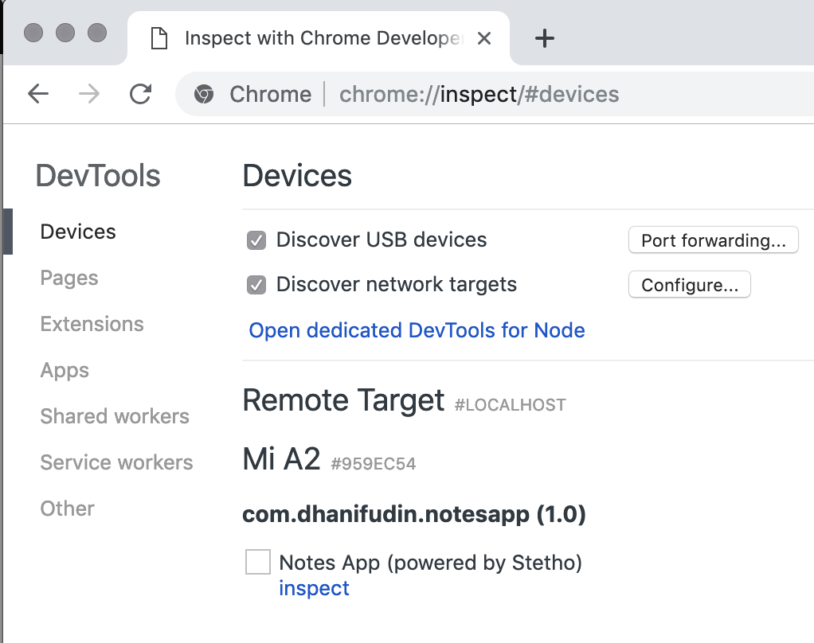

# Menyiapkan Dependency

Untuk memudahkan mengembangkan android SQLite diperlukan beberapa dependencies
tambahan. Pada percobaan berikut akan digunakan room persistence untuk menangani
operasi-operasi database SQLite.

- Bukalah file `build.gradle` dan tambahkan library dependency dari room
 persistence dan lifecycle.

  ```gradle
  implementation 'android.arch.persistence.room:runtime:1.1.1'
  annotationProcessor 'android.arch.persistence.room:compiler:1.1.1'

  implementation 'android.arch.lifecycle:viewmodel:1.1.1'
  implementation 'android.arch.lifecycle:extensions:1.1.1'
  ```

## Opsional

> **Note**: Untuk memudahkan melihat isi data dalam SQLite, anda juga dapat
> menambahkan library `Stetho` dari facebook. Untuk melihat isi, anda dapat
> menggunakan Google Chrome dengan mengakses `chrome://inspect` dan pilih menu
> devices. Lakukan inspect remote target pada device yang tersedia dengan
> mengklik link `inspect` pada list aplikasi yang muncul.



```gradle
implementation 'com.facebook.stetho:stetho:1.5.0'
```

- Buatlah file class baru dengan nama `MyApplication` yang merupakan turunan
 dari `android.app.Application`.

```java
public class MyApplication extends Application {

  @Override
  public void onCreate() {
    super.onCreate();
    Stetho.initializeWithDefaults(this);
  }

}
```

- Modifikasi file `AndroidManifest.xml` pada element `application` tambahkan
 property `android:name` dan set nilai menjadi `.MyApplication`.

```xml
<application
  android:name=".MyApplication"
  android:allowBackup="true"
  android:icon="@mipmap/ic_launcher"
  android:label="@string/app_name"
  android:roundIcon="@mipmap/ic_launcher_round"
  android:supportsRtl="true"
  android:theme="@style/AppTheme">
  <activity
  ....
  </activity>
</application>
```
