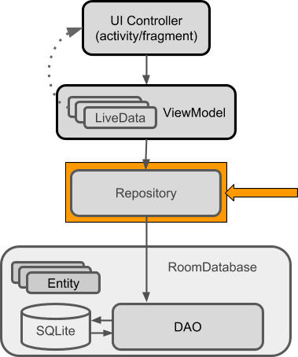

# Membuat Repository



Repository adalah sebuah class yang mengabstraksi akses ke sumber data.
Sebenarnya repository bukan merupakan Architecture Component, tetapi pendekatan
ini direkomendasikan untuk membagi kode. Sebuah class `Repository` menangani
operasi data untuk menyediakan API yang clean.


Langkah-langkah dalam membuat repository, dapat mengikuti langkah berikut:

- Buatlah package `repositories` untuk mengorganisasi class `Repository` yang
 dibutuhkan.
- Tambahkan class `UserRepository` ke dalam package `repositories`.

  ```java
  public class UserRepository {

  }
  ```
- Tambahkan atribut dengan jenis `UserDao`.

  ```java
  private UserDao dao;
  ```

- Tambahkan constructor `UserRepository` yang menerima argumen `Application`.

  ```java
  public UserRepository(Application application) {

  }
  ```

- Instansiasi atribut yang digunakan `UserRepository`.

  ```java
  AppDatabase db = AppDatabase.getInstance(application);
  dao = db.userDao();
  ```

- Tambahkan abstraksi operasi untuk mendapatkan user berdasarkan `username`.

  ```java
  public LiveData<User> getUserByUsername(String username) {
    return dao.getUserByUsername(username);
  }
  ```

- Tambahkan abstraksi operasi untuk insert user.

  ```java
  public void insert(User user) {
    ...
  }
  ```

- Untuk melakukan operasi yang berkaitan dengan database sebaiknya jangan dilakukan di main UI thread. Untuk menangani problem tersebut diperlukan `AsyncTask`. Pada operasi mengambil data user, tidak diperlukan `AsyncTask` karena sudah ditangani oleh `LiveData`.

- Buatlah inner class `InsertAsyncTask` di dalam class `UserRepository`.

  ```java
  private static class InsertAsyncTask extends AsyncTask<User, Void, Void> {

  ...

  }
  ```

- Pada baris class `InsertAsyncTask` tekan shortcut `Alt-Enter`, pilih implement
 methods menu.

- Tambahkan atribut `asyncTaskDao` dengan tipe `Userdao`.

  ```java
  private UserDao asyncTaskDao;
  ```

- Tambahkan constructor `InsertAsyncTask`

  ```java
  InsertAsyncTask(UserDao dao) {
    asyncTaskDao = dao;
  }
  ```

- Implementasi operasi yang dijalankan secara *background*

  ```java
  @Override
  protected Void doInBackground(User... users) {
    asyncTaskDao.insert(users);
    return null;
  }
  ```

- Jika `InsertAsyncTask` telah diimplementasikan, tambahkan operasi insert yang
 nanti dijalankan secara background.

  ```java
  public void insert(User user) {
    new InsertAsyncTask(dao).execute(user);
  }
  ```

- Implementasi `UserRepository` telah selesai, lanjutkan untuk membuat
 repository terkait dengan `Note`, dan beri nama `NoteRepository`.

  ```java
  public class NoteRepository {
    ...
  }
  ```

- Tambahkan atribut untuk mengakses terkait data `Note` melalui DAO.

  ```java
  private NoteDao noteDao;
  ```

- Tambahkan atribut untuk menampung data kumpulan `Note` dengan jenis
 `LiveData`.

  ```java
  private LiveData<List<Note>> notes;
  ```

- Sisipkan constructor `NoteRepository` yang menerima argumen `Application`

  ```java
  public NoteRepository(Application application) {
    ...
  }
  ```

- Instansiasi atribut-atribut yang telah didefinisikan, serta fetch semua data
 `Note` yang tersimpan.

  ```java
  ...
  AppDatabase db = AppDatabase.getInstance(application);
  noteDao = db.noteDao();
  notes = noteDao.getAll();
  ...
  ```

- Tambahkan operasi pengambilan data catatan yang telah tersimpan dalam atribut `notes`.

  ```java
  public LiveData<List<Note>> getNotes() {
    return notes;
  }
  ```

- Pada data `Note` dibutuhkan operasi insert serta update, dikarenakan operasi
 tersebut tidak disarankan dijalankan di main UI thread maka dibutuhkan inner
 class AsyncTask. Buatlah inner class `InsertAsyncTask` yang digunakan untuk
 operasi **insert** dan `UpdateAsyncTask` untuk operasi **update**. Isi
 implementasi dalam AsyncTask dapat mengadaptasi dari `InsertAsyncTask` dalam
 `UserRepository`.

- Implementasikan operasi insert serta update

  ```java
  public void insert(Note note) {
    new InsertAsyncTask(noteDao)
      .execute(note);
  }
  ```

  ```java
  public void update(Note note) {
    new UpdateAsyncTask(noteDao)
      .execute(note);
  }
  ```
