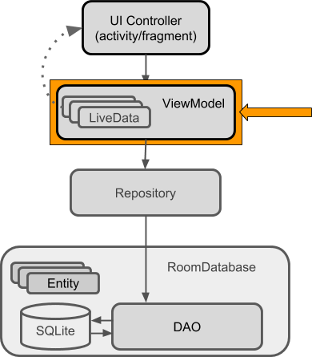
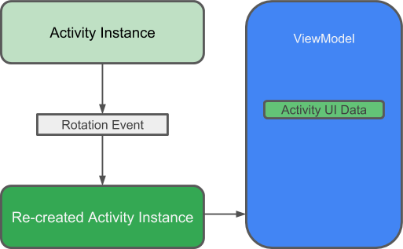

# Membuat ViewModel





Untuk mengimplementasikan `ViewModel` silahkan mengikuti langkah-langkah
berikut:

- Buatlah class `UserViewModel` yang diturunkan dari class `AndroidViewModel`.

  ```java
  public class UserViewModel extends AndroidViewModel {
    ...
    ...
  }
  ```

- Tekan tombol `Alt-Enter` pada baris kode yang bergaris bawah merah, kemudian
 pilih menu `Create constructor matching super`.

- Tambahkan atribut-atribut berikut ke dalam `UserViewModel`.

  ```java
  private UserRepository repository;
  private LiveData<User> user;
  ```

- Modifikasi constructor yang telah di auto generate, tambahkan untuk
 instansiasi atribut `repository`.

  ```java
  ...
  this.repository = new UserRepository(application);
  ...
  ```

- `UserRepository` bertanggung jawab untuk proses login dan register user, untuk
  menangani proses tersebut buatlah method `getUser()` yang akan mendapatkan
  user berdasarkan `username` serta method `insert()` yang digunakan untuk
  proses registrasi.

  ```java
  public LiveData<User> getUser(String username) {
    user = repository.getUserByUsername(username);
    return user;
  }
  ```

  ```java
  public void insert(User user) {
    repository.insert(user);
  }
  ```

- Tambahkan class `NoteViewModel` yang diturunkan dari `AndroidViewModel`.

  ```java
  public class NoteViewModel extends AndroidViewModel {
    ...
    ...
  }
  ```

- Generate constructor dengan menggunakan shortcut `Alt-Enter`

- Kemudian, tambahkan atribut-atribut berikut

  ```java
  private NoteRepository repository;
  private LiveData<List<Note>> notes;
  ```
- Modifikasi constructor bawaan dengan menambahkan pernyataan berikut yang
 digunakan untuk menginstansiasi obyek serta mengambil nilai awal.

  ```java
  ...
  this.repository = new NoteRepository(application);
  this.notes = repository.getNotes();
  ...
  ```

- Buatlah method getter untuk mendapatkan semua data catatan, ketik `getNotes`
 kemudian tekan enter.

- Buatlah method untuk melakukan operasi insert, proses insert akan dilakukan
 oleh repository.

  ```
  public void insert(Note note) {
  repository.insert(note);
  }
  ```

- Buatlah method untuk melakukan operasi update, proses update akan dilakukan
 oleh repository.

  ```java
  public void update(Note note) {
    repository.update(note);
  }
  ```
