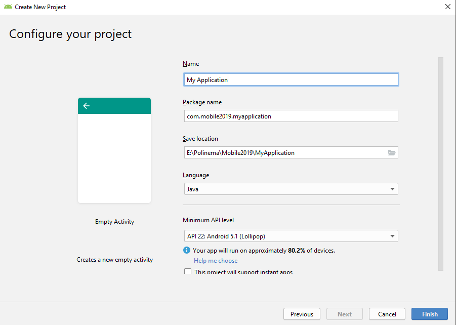
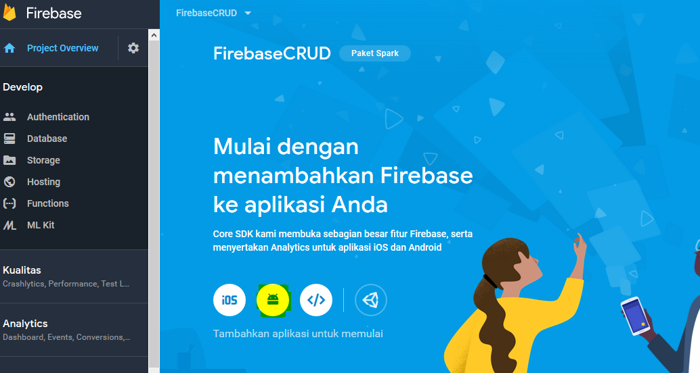

# Firebase CRUD

## Kemampuan akhir yang diharapkan

Setelah melakukan praktikum ini mahasiswa mampu :

1.	Membuat realtime database dan authentication pada firebase
2.	Melakukan sinkronisasi firebase realtime database dengan aplikasi android
3.	Membuat apikasi CRUD menggunakan firebase realtime database

## Dasar Teori

Firebase adalah suatu layanan dari google untuk mempermudah para pengembang-pengembang aplikasi untuk mengembangkan aplikasinya. **Firebase(BaaS ‘Backend as a Service’)** ini merupakan solusi yang ditawarkan oleh Google untuk mempermudah pekerjaan Developer. Dengan adanya Firebase, apps developer dapat fokus mengembangkan aplikasi tanpa harus memberikan usaha yang besar terkait pengelolaan backend.

### 1. Firebase Realtime Database 
Firebase Realtime Database adalah sebuah cloud based NoSQL database yang tersedia secara realtime dan bisa diakses cross platform baik dari Android, iOS, maupun Web. Data pada Firebase Realtime Database disimpan dalam bentuk JSON tree yang selalu tersinkron secara realtime. Karena sifatnya yang realtime, jika ada perubahan pada database, maka semua klien yang menggunakan Realtime Database ini akan tersinkron secara otomatis. Dan juga jenis database-nya yang bertipe NoSQL, sangat cocok ketika kita ingin menyimpan data bersifat key-value pada aplikasi.
### 2. Firebase Authentication
Firebase authentication memberikan fungsi dalam mengelelola akun pengguna dengan cara yang mudah dan aman. Firebase Auth menawarkan beberapa metode autentikasi, termasuk email/sandi, penyedia pihak ketiga seperti Google atau Facebook, atau langsung menggunakan sistem akun Anda yang sudah ada.

## Praktikum

### Menambahkan Firebase pada project aplikasi Android

1. Pada langkah pertama buat project baru dengan empty activity, seperti gambar berikut:




2.Pada langkah berikutnya login/masuk pada Firebase dengan menggunakan Alamat Gmail kalian, pada link berikut ini https://firebase.google.com/?hl=id kemudian pilih Buka Console


3. Selanjutnya tambahkan project baru kita kedalam Firebase Console, dengan mengklik `Tambahkan proyek(+)`.


4. Isi nama proyek, ID project dan Negara/Wilayah kalian, setelah itu klik Buat Proyek.


5. Pada halaman Dashboard Firebase, disini pilih platform yang akan digunakan, klik icon berlogo android, untuk menambahkan Firebase kedalam aplikasi Android.



6. Isi nama package (wajib), nama pendek aplikasi (jika diperlukan), lalu masukan kode SHA-1 kedalam Firebase.


7. Download File Konfigurasi **google-services.json**, setelah selesai, pindahkan file tersebut pada direktori `app/root` yang terdapat pada project aplikasi.


8. Tambahkan Firebase SDK pada file `build.gradle(Project-Level)`, masukan plugin dibawah ini:

```java
dependencies {
    classpath 'com.android.tools.build:gradle:3.3.2'
    classpath 'com.google.gms:google-services:3.2.0'
    

    // NOTE: Do not place your application dependencies here; they belong
    // in the individual module build.gradle files
}
```

9. Buka `bulid.gradle(app-level)` lalu tambahkan library di bawah ini dalam dependencies.

```java
dependencies {
    implementation fileTree(dir: 'libs', include: ['*.jar'])
    implementation 'com.android.support:appcompat-v7:27.0.2'
    implementation 'com.android.support:design:27.0.2'
    implementation 'com.android.support:recyclerview-v7:27.0.2'
    implementation 'com.android.support:support-v4:27.0.2'
    implementation 'com.google.firebase:firebase-core:11.8.0'
    implementation 'com.firebaseui:firebase-ui-auth:3.2.2'
    implementation 'com.google.firebase:firebase-database:11.8.0'
    implementation 'com.google.android.gms:play-services-auth:11.8.0'
    implementation 'com.android.support.constraint:constraint-layout:1.1.0'
    testImplementation 'junit:junit:4.12'
    androidTestImplementation 'com.android.support.test:runner:1.0.1'
    androidTestImplementation 'com.android.support.test.espresso:espresso-core:3.0.1'
}
```

10. Lalu tambahkan kode **apply plugin: 'com.google.gms.google-services'** di bagian bawah dependencies seperti gambar berikut ini:

```java
dependencies {
    implementation fileTree(dir: 'libs', include: ['*.jar'])
    implementation 'com.android.support:appcompat-v7:27.0.2'
    implementation 'com.android.support:design:27.0.2'
    implementation 'com.android.support:recyclerview-v7:27.0.2'
    implementation 'com.android.support:support-v4:27.0.2'
    implementation 'com.google.firebase:firebase-core:11.8.0'
    implementation 'com.firebaseui:firebase-ui-auth:3.2.2'
    implementation 'com.google.firebase:firebase-database:11.8.0'
    implementation 'com.google.android.gms:play-services-auth:11.8.0'
    implementation 'com.android.support.constraint:constraint-layout:1.1.0'
    testImplementation 'junit:junit:4.12'
    androidTestImplementation 'com.android.support.test:runner:1.0.1'
    androidTestImplementation 'com.android.support.test.espresso:espresso-core:3.0.1'
}
apply plugin: 'com.google.gms.google-services'
```
