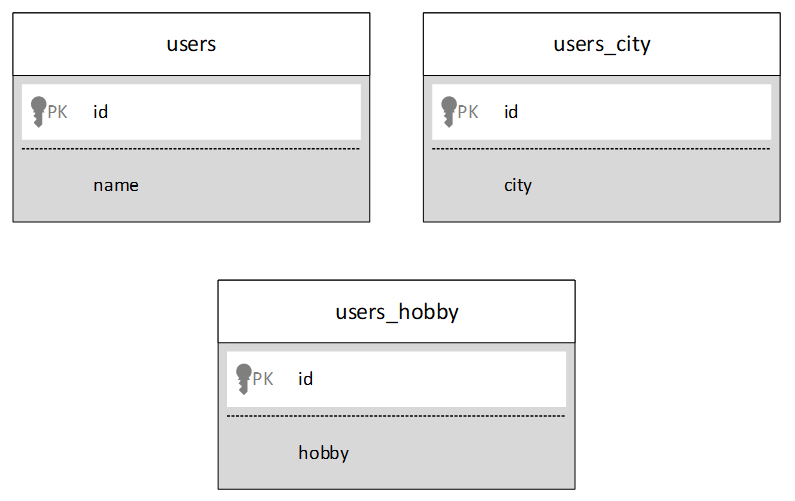
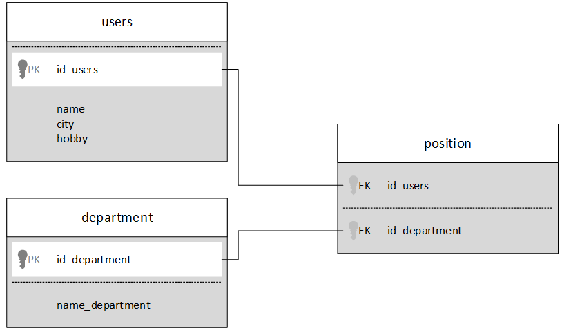

# Kemampuan Akhir Yang Direncanakan

- Mahasiswa mampu membuat database SQlite yang memiliki relasi pada aplikasi android.
- Mahasiswa mampu membuat aplikasi yang menampilkan data dari SQLite ke Recycler View.
- Mahasiswa mampu membuat aplikasi “master - detail” menggunakan data dari SQlite

# Modul

Membuat SQLite Dengan Banyak Tabel Di Android
Memahami Struktur Tabel Dari SQLite Dengan Banyak Tabel Di Android



Membuat tiga tabel.
1.	users - Nama pengguna disimpan dalam tabel ini.
2.	users_hobby - Hobi pengguna disimpan di sini.
3.	users_city - Kota pengguna disimpan di sini.

Sekarang kolom "id" adalah hal utama. Kami akan mereferensikan semua nilai di seluruh tabel dengan "id."
Dalam tabel pengguna, id untuk Peter adalah 1. Dalam tabel users_hobby, sebuah hobi sesuai dengan id 1 adalah “memanjat.” Jadi, hobi untuk Peter adalah memanjat.
Di tabel users_city, kota yang sesuai dengan id 1 adalah "Malang." Jadi, kota untuk Peter adalah Malang.
Demikian pula, contoh yang lain bahwa hobi untuk Lely adalah berenang dan kotanya adalah Surabaya.
Sekarang langsung ke Android Studio dan ikuti langkah-langkah untuk membuat SQLite dengan beberapa tabel di Android.

## Langkah 1: Buat proyek baru di Android Studio.
## Langkah 2: Membuat kelas UserModel
Buat kelas Java bernama "UserModel" dan tambahkan kode sumber berikut
```java

import java.io.Serializable;
public class UserModel implements Serializable{

    private String name, hobby, city;
    private int id;

    public String getCity() {
        return city;
    }

    public void setCity(String city) {
        this.city = city;
    }

    public int getId() {
        return id;
    }

    public void setId(int id) {
        this.id = id;
    }

    public String getName() {
        return name;
    }

    public void setName(String name) {
        this.name = name;
    }

    public String getHobby() {
        return hobby;
    }

    public void setHobby(String hobby) {
        this.hobby = hobby;
    }
}
```

# Langkah 3: Membuat kelas DatabaseHelper
Siapkan kelas bernama "DatabaseHelper" dan tulis kode berikut

```java

import android.content.ContentValues;
import android.content.Context;
import android.database.Cursor;
import android.database.sqlite.SQLiteDatabase;
import android.database.sqlite.SQLiteOpenHelper;
import android.util.Log;
import java.util.ArrayList;
public class DatabaseHelper extends SQLiteOpenHelper {

    public static String DATABASE_NAME = "user_database";
    private static final int DATABASE_VERSION = 1;
    private static final String TABLE_USER = "users";
    private static final String TABLE_USER_HOBBY = "users_hobby";
    private static final String TABLE_USER_CITY = "users_city";
    private static final String KEY_ID = "id";
    private static final String KEY_FIRSTNAME = "name";
    private static final String KEY_HOBBY = "hobby";
    private static final String KEY_CITY = "city";

    /*CREATE TABLE students ( id INTEGER PRIMARY KEY AUTOINCREMENT, name TEXT, phone_number TEXT......);*/

    private static final String CREATE_TABLE_STUDENTS = "CREATE TABLE "
            + TABLE_USER + "(" + KEY_ID
            + " INTEGER PRIMARY KEY AUTOINCREMENT," + KEY_FIRSTNAME + " TEXT );";

    private static final String CREATE_TABLE_USER_HOBBY = "CREATE TABLE "
            + TABLE_USER_HOBBY + "(" + KEY_ID + " INTEGER,"+ KEY_HOBBY + " TEXT );";

    private static final String CREATE_TABLE_USER_CITY = "CREATE TABLE "
            + TABLE_USER_CITY + "(" + KEY_ID + " INTEGER,"+ KEY_CITY + " TEXT );";

    public DatabaseHelper(Context context) {
        super(context, DATABASE_NAME, null, DATABASE_VERSION);

        Log.d("table", CREATE_TABLE_STUDENTS);
    }

    @Override
    public void onCreate(SQLiteDatabase db) {
        db.execSQL(CREATE_TABLE_STUDENTS);
        db.execSQL(CREATE_TABLE_USER_HOBBY);
        db.execSQL(CREATE_TABLE_USER_CITY);
    }

    @Override
    public void onUpgrade(SQLiteDatabase db, int oldVersion, int newVersion) {
        db.execSQL("DROP TABLE IF EXISTS '" + TABLE_USER + "'");
        db.execSQL("DROP TABLE IF EXISTS '" + TABLE_USER_HOBBY + "'");
        db.execSQL("DROP TABLE IF EXISTS '" + TABLE_USER_CITY + "'");
        onCreate(db);
    }

    public void addUser(String name, String hobby, String city) {
        SQLiteDatabase db = this.getWritableDatabase();
        //adding user name in users table
        ContentValues values = new ContentValues();
        values.put(KEY_FIRSTNAME, name);
       // db.insert(TABLE_USER, null, values);
        long id = db.insertWithOnConflict(TABLE_USER, null, values,
                SQLiteDatabase.CONFLICT_IGNORE);

        //adding user hobby in users_hobby table
        ContentValues valuesHobby = new ContentValues();
        valuesHobby.put(KEY_ID, id);
        valuesHobby.put(KEY_HOBBY, hobby);
        db.insert(TABLE_USER_HOBBY, null, valuesHobby);

        //adding user city in users_city table
        ContentValues valuesCity = new ContentValues();
        valuesCity.put(KEY_ID, id);
        valuesCity.put(KEY_CITY, city);
        db.insert(TABLE_USER_CITY, null, valuesCity);
    }

    public ArrayList<UserModel> getAllUsers() {
        ArrayList<UserModel> userModelArrayList = new ArrayList<UserModel>();

        String selectQuery = "SELECT  * FROM " + TABLE_USER;
        SQLiteDatabase db = this.getReadableDatabase();
        Cursor c = db.rawQuery(selectQuery, null);
        // looping through all rows and adding to list
        if (c.moveToFirst()) {
            do {
                UserModel userModel = new UserModel();
                userModel.setId(c.getInt(c.getColumnIndex(KEY_ID)));
                userModel.setName(c.getString(c.getColumnIndex(KEY_FIRSTNAME)));

                    //getting user hobby where id = id from user_hobby table
                    String selectHobbyQuery = "SELECT  * FROM " + TABLE_USER_HOBBY +" WHERE "
                            +KEY_ID+" = "+ userModel.getId();
                    Log.d("oppp",selectHobbyQuery);
                    //SQLiteDatabase dbhobby = this.getReadableDatabase();
                    Cursor cHobby = db.rawQuery(selectHobbyQuery, null);

                        if (cHobby.moveToFirst()) {
                            do {
                                userModel.setHobby(cHobby.getString(cHobby.getColumnIndex(KEY_HOBBY)));
                            } while (cHobby.moveToNext());
                        }

                    //getting user city where id = id from user_city table
                    String selectCityQuery = "SELECT  * FROM " + TABLE_USER_CITY+" WHERE "+KEY_ID+
                            " = "+ userModel.getId();;
                    //SQLiteDatabase dbCity = this.getReadableDatabase();
                    Cursor cCity = db.rawQuery(selectCityQuery, null);

                    if (cCity.moveToFirst()) {
                        do {
                            userModel.setCity(cCity.getString(cCity.getColumnIndex(KEY_CITY)));
                        } while (cCity.moveToNext());
                    }

                    // adding to Students list
                    userModelArrayList.add(userModel);
                } while (c.moveToNext());
         }
        return userModelArrayList;
    }

    public void updateUser(int id, String name, String hobby, String city) {
        SQLiteDatabase db = this.getWritableDatabase();

        // updating name in users table
        ContentValues values = new ContentValues();
        values.put(KEY_FIRSTNAME, name);
        db.update(TABLE_USER, values, KEY_ID + " = ?", new String[]{String.valueOf(id)});

        // updating hobby in users_hobby table
        ContentValues valuesHobby = new ContentValues();
        valuesHobby.put(KEY_HOBBY, hobby);
        db.update(TABLE_USER_HOBBY, valuesHobby, KEY_ID + " = ?", new String[]{String.valueOf(id)});

        // updating city in users_city table
        ContentValues valuesCity = new ContentValues();
        valuesCity.put(KEY_CITY, city);
        db.update(TABLE_USER_CITY, valuesCity, KEY_ID + " = ?", new String[]{String.valueOf(id)});
    }

    public void deleteUSer(int id) {

        // delete row in students table based on id
        SQLiteDatabase db = this.getWritableDatabase();

        //deleting from users table
        db.delete(TABLE_USER, KEY_ID + " = ?",new String[]{String.valueOf(id)});

        //deleting from users_hobby table
        db.delete(TABLE_USER_HOBBY, KEY_ID + " = ?", new String[]{String.valueOf(id)});

        //deleting from users_city table
        db.delete(TABLE_USER_CITY, KEY_ID + " = ?",new String[]{String.valueOf(id)});
    }

}
```

# Langkah 4: Deskripsi DatabaseHelper
Nama database, versi Database, nama tabel dan nama kolom tabel ditulis seperti di bawah ini.

```java
public static String DATABASE_NAME = "user_database";
private static final int DATABASE_VERSION = 1;
private static final String TABLE_USER = "users";
private static final String TABLE_USER_HOBBY = "users_hobby";
private static final String TABLE_USER_CITY = "users_city";
private static final String KEY_ID = "id";
private static final String KEY_FIRSTNAME = "name";
private static final String KEY_HOBBY = "hobby";
private static final String KEY_CITY = "city";
```

Memahami bagian terpenting dari SQLite Database
Dalam metod onCreate (), buat pernyataan untuk tabel.

```java
@Override
public void onCreate(SQLiteDatabase db) {
    db.execSQL(CREATE_TABLE_STUDENTS);
    db.execSQL(CREATE_TABLE_USER_HOBBY);
    db.execSQL(CREATE_TABLE_USER_CITY);
}
```

Dalam metod onUpgrade (), already exist tables are dropped and then all the tables are recreated.
metod onCreate () dipanggil ke metod onUpgrade () untuk membuat tabel.

```java
@Override
public void onUpgrade(SQLiteDatabase db, int oldVersion, int newVersion) {
    db.execSQL("DROP TABLE IF EXISTS '" + TABLE_USER + "'");
    db.execSQL("DROP TABLE IF EXISTS '" + TABLE_USER_HOBBY + "'");
    db.execSQL("DROP TABLE IF EXISTS '" + TABLE_USER_CITY + "'");
    onCreate(db);
}
```

# Langkah 5: Mempersiapkan file lv_item.xml
Buat file tampilan bernama "lv_item.xml" dan tambahkan sebagai berikut

```xml
<?xml version="1.0" encoding="utf-8"?>
<LinearLayout xmlns:android="http://schemas.android.com/apk/res/android"
    android:layout_width="match_parent"
    android:layout_height="match_parent"
    android:padding="10dp"
    android:orientation="vertical">

    <LinearLayout
        android:layout_width="match_parent"
        android:layout_height="wrap_content"
        android:background="#000"
        android:orientation="vertical">

         <TextView
            android:id="@+id/name"
            android:layout_width="match_parent"
            android:layout_height="wrap_content"
             android:textColor="#fff"
             android:layout_marginTop="10dp"
            android:gravity="center_vertical"
            android:textAppearance="?android:attr/textAppearanceMedium"
            android:paddingLeft="10dp"
            android:text="Name" />
        <TextView
            android:id="@+id/hobby"
            android:layout_width="match_parent"
            android:layout_height="wrap_content"
            android:textColor="#fff"
            android:gravity="center_vertical"
            android:textAppearance="?android:attr/textAppearanceMedium"
            android:paddingLeft="10dp"
            android:text="Hobby" />
        <TextView
            android:id="@+id/city"
            android:layout_width="match_parent"
            android:layout_height="wrap_content"
            android:textColor="#fff"
            android:gravity="center_vertical"
            android:textAppearance="?android:attr/textAppearanceMedium"
            android:paddingLeft="10dp"
            android:text="City" />


    </LinearLayout>
    <View
        android:layout_width="match_parent"
        android:layout_height="1dp"
        android:layout_marginTop="10dp"
        android:layout_marginLeft="10dp"
        android:layout_marginRight="10dp"
        android:background="@color/colorAccent"/>
</LinearLayout>
```

# Langkah 6: Mempersiapkan kelas CustomAdapter
Buat kelas Java bernama "CustomAdapter" dan tulis seperti dibawah ini

```java
import android.content.Context;
import android.view.LayoutInflater;
import android.view.View;
import android.view.ViewGroup;
import android.widget.BaseAdapter;
import android.widget.TextView;
import java.util.ArrayList;

public class CustomAdapter extends BaseAdapter {

    private Context context;
    private ArrayList<UserModel> userModelArrayList;

    public CustomAdapter(Context context, ArrayList<UserModel> userModelArrayList) {

        this.context = context;
        this.userModelArrayList = userModelArrayList;
    }


    @Override
    public int getCount() {
        return userModelArrayList.size();
    }

    @Override
    public Object getItem(int position) {
        return userModelArrayList.get(position);
    }

    @Override
    public long getItemId(int position) {
        return 0;
    }

    @Override
    public View getView(int position, View convertView, ViewGroup parent) {
        ViewHolder holder;

        if (convertView == null) {
            holder = new ViewHolder();
            LayoutInflater inflater = (LayoutInflater) context
                    .getSystemService(Context.LAYOUT_INFLATER_SERVICE);
            convertView = inflater.inflate(R.layout.lv_item, null, true);

            holder.tvname = (TextView) convertView.findViewById(R.id.name);
            holder.tvhobby = (TextView) convertView.findViewById(R.id.hobby);
            holder.tvcity = (TextView) convertView.findViewById(R.id.city);


            convertView.setTag(holder);
        }else {
            // the getTag returns the viewHolder object set as a tag to the view
            holder = (ViewHolder)convertView.getTag();
        }

        holder.tvname.setText("Name: "+userModelArrayList.get(position).getName());
        holder.tvhobby.setText("Hobby: "+userModelArrayList.get(position).getHobby());
        holder.tvcity.setText("City: "+userModelArrayList.get(position).getCity());

        return convertView;
    }

    private class ViewHolder {

        protected TextView tvname, tvhobby, tvcity;
    }

}
```

# Step 7: Mendapatkan Semua Pengguna Dari Basis Data SQLite
Buat aktivitas baru bernama "GetAllUsersActivity."

```java
import android.content.Intent;
import android.support.v7.app.AppCompatActivity;
import android.os.Bundle;
import android.view.View;
import android.widget.AdapterView;
import android.widget.ListView;
import java.util.ArrayList;

public class GetAllUsersActivity extends AppCompatActivity {

    private ListView listView;
    private ArrayList<UserModel> userModelArrayList;
    private CustomAdapter customAdapter;
    private DatabaseHelper databaseHelper;

    @Override
    protected void onCreate(Bundle savedInstanceState) {
        super.onCreate(savedInstanceState);
        setContentView(R.layout.activity_get_all_users);

        listView = (ListView) findViewById(R.id.lv);

        databaseHelper = new DatabaseHelper(this);

        userModelArrayList = databaseHelper.getAllUsers();

        customAdapter = new CustomAdapter(this,userModelArrayList);
        listView.setAdapter(customAdapter);

        listView.setOnItemClickListener(new AdapterView.OnItemClickListener() {
            @Override
            public void onItemClick(AdapterView<?> parent, View view, int position, long id) {
                Intent intent = new Intent(GetAllUsersActivity.this, UpdateDeleteActivity.class);
                intent.putExtra("user", userModelArrayList.get(position));
                startActivity(intent);
            }
        });

    }
}
```

Tulis kode dibawa ini di activity_get_all_users.xml
```xml
<?xml version="1.0" encoding="utf-8"?>
<LinearLayout xmlns:android="http://schemas.android.com/apk/res/android"
    xmlns:tools="http://schemas.android.com/tools"
    android:layout_width="match_parent"
    android:layout_height="match_parent"
    android:background="@color/colorAccent"
    android:orientation="vertical"
    tools:context=".GetAllUsersActivity">

    <TextView
        android:layout_width="match_parent"
        android:layout_height="wrap_content"
        android:gravity="center"
        android:layout_marginTop="10dp"
        android:textSize="20sp"
        android:textColor="#000"
        android:text="Data from SQLite"/>

    <ListView
        android:layout_width="match_parent"
        android:layout_height="match_parent"
        android:id="@+id/lv">


    </ListView>

</LinearLayout>
```

# Langkah 8: Updating and deleting user information
Buat aktivitas baru bernama "UpdateDeleteActivity"

```java
import android.content.Intent;
import android.support.v7.app.AppCompatActivity;
import android.os.Bundle;
import android.view.View;
import android.widget.Button;
import android.widget.EditText;
import android.widget.Toast;

public class UpdateDeleteActivity extends AppCompatActivity {

    private UserModel userModel;
    private EditText etname, ethobby, etcity;
    private Button btnupdate, btndelete;
    private DatabaseHelper databaseHelper;

    @Override
    protected void onCreate(Bundle savedInstanceState) {
        super.onCreate(savedInstanceState);
        setContentView(R.layout.activity_update_delete);

        Intent intent = getIntent();
        userModel = (UserModel) intent.getSerializableExtra("user");

        databaseHelper = new DatabaseHelper(this);

        etname = (EditText) findViewById(R.id.etname);
        ethobby = (EditText) findViewById(R.id.ethobby);
        etcity = (EditText) findViewById(R.id.etcity);
        btndelete = (Button) findViewById(R.id.btndelete);
        btnupdate = (Button) findViewById(R.id.btnupdate);

        etname.setText(userModel.getName());
        ethobby.setText(userModel.getHobby());
        etcity.setText(userModel.getCity());

        btnupdate.setOnClickListener(new View.OnClickListener() {
            @Override
            public void onClick(View v) {
                databaseHelper.updateUser(userModel.getId(),etname.getText().toString(),
                        ethobby.getText().toString(),etcity.getText().toString());
                Toast.makeText(UpdateDeleteActivity.this, "Updated Successfully!",
                        Toast.LENGTH_SHORT).show();
                Intent intent = new Intent(UpdateDeleteActivity.this,MainActivity.class);
                intent.addFlags(Intent.FLAG_ACTIVITY_CLEAR_TASK | Intent.FLAG_ACTIVITY_NEW_TASK);
                startActivity(intent);
            }
        });

        btndelete.setOnClickListener(new View.OnClickListener() {
            @Override
            public void onClick(View v) {
                databaseHelper.deleteUSer(userModel.getId());
                Toast.makeText(UpdateDeleteActivity.this, "Deleted Successfully!",
                        Toast.LENGTH_SHORT).show();
                Intent intent = new Intent(UpdateDeleteActivity.this,MainActivity.class);
                intent.addFlags(Intent.FLAG_ACTIVITY_CLEAR_TASK | Intent.FLAG_ACTIVITY_NEW_TASK);
                startActivity(intent);
            }
        });

    }
}
```

Tulis kode berikut di activity_update_delete.xml
```xml
<?xml version="1.0" encoding="utf-8"?>
<LinearLayout xmlns:android="http://schemas.android.com/apk/res/android"
    xmlns:tools="http://schemas.android.com/tools"
    android:layout_width="match_parent"
    android:layout_height="match_parent"
    android:background="@color/colorAccent"
    android:orientation="vertical"
    tools:context=".UpdateDeleteActivity">

    <TextView
        android:layout_width="match_parent"
        android:layout_height="wrap_content"
        android:text="Name"
        android:layout_marginLeft="10dp"
        android:layout_marginTop="10dp"
        android:textColor="#000"
        android:textSize="20sp"/>
    <EditText
        android:layout_width="match_parent"
        android:layout_height="40dp"
        android:id="@+id/etname"
        android:background="#fff"
        android:layout_marginLeft="10dp"
        android:layout_marginTop="10dp"
        android:layout_marginRight="10dp"
        android:hint="Enter Name"/>
    <TextView
        android:layout_width="match_parent"
        android:layout_height="wrap_content"
        android:text="Hobby"
        android:layout_marginLeft="10dp"
        android:layout_marginTop="10dp"
        android:textColor="#000"
        android:textSize="20sp"/>
    <EditText
        android:layout_width="match_parent"
        android:layout_height="40dp"
        android:id="@+id/ethobby"
        android:background="#fff"
        android:layout_marginLeft="10dp"
        android:layout_marginTop="10dp"
        android:layout_marginRight="10dp"
        android:hint="Enter Hobby"/>

    <TextView
        android:layout_width="match_parent"
        android:layout_height="wrap_content"
        android:text="City"
        android:layout_marginLeft="10dp"
        android:layout_marginTop="10dp"
        android:textColor="#000"
        android:textSize="20sp"/>
    <EditText
        android:layout_width="match_parent"
        android:layout_height="40dp"
        android:id="@+id/etcity"
        android:background="#fff"
        android:layout_marginLeft="10dp"
        android:layout_marginTop="10dp"
        android:layout_marginRight="10dp"
        android:hint="Enter City"/>

        <LinearLayout
            android:layout_width="match_parent"
            android:layout_height="match_parent"
            android:orientation="horizontal">
            <Button
                android:layout_width="wrap_content"
                android:layout_height="wrap_content"
                android:layout_marginTop="10dp"
                android:layout_marginLeft="10dp"
                android:id="@+id/btnupdate"
                android:text="update"/>
            <Button
                android:layout_width="wrap_content"
                android:layout_height="wrap_content"
                android:layout_marginTop="10dp"
                android:layout_marginLeft="10dp"
                android:id="@+id/btndelete"
                android:text="delete"/>
        </LinearLayout>
</LinearLayout>
```

# Langkah 9: Mempersiapkan MainActivity
Tambahkan kode di bawah ini di MainActivity.java

```java
import android.content.Intent;
import android.support.v7.app.AppCompatActivity;
import android.os.Bundle;
import android.view.View;
import android.widget.Button;
import android.widget.EditText;
import android.widget.Toast;
public class MainActivity extends AppCompatActivity {

    private Button btnStore, btnGetall;
    private EditText etname, ethobby, etcity;
    private DatabaseHelper databaseHelper;

    @Override
    protected void onCreate(Bundle savedInstanceState) {
        super.onCreate(savedInstanceState);
        setContentView(R.layout.activity_main);

        databaseHelper = new DatabaseHelper(this);

        btnStore = (Button) findViewById(R.id.btnstore);
        btnGetall = (Button) findViewById(R.id.btnget);
        etname = (EditText) findViewById(R.id.etname);
        ethobby = (EditText) findViewById(R.id.ethobby);
        etcity = (EditText) findViewById(R.id.etcity);

        btnStore.setOnClickListener(new View.OnClickListener() {
            @Override
            public void onClick(View v) {
                databaseHelper.addUser(etname.getText().toString(), ethobby.getText().toString(),
                        etcity.getText().toString());
                etname.setText("");
                ethobby.setText("");
                etcity.setText("");
                Toast.makeText(MainActivity.this, "Stored Successfully!",
                        Toast.LENGTH_SHORT).show();
            }
        });

        btnGetall.setOnClickListener(new View.OnClickListener() {
            @Override
            public void onClick(View v) {
                Intent intent = new Intent(MainActivity.this, GetAllUsersActivity.class);
                startActivity(intent);
            }
        });

    }
}
```

Tulis kode berikut dalam activity_main.xml
```xml
<?xml version="1.0" encoding="utf-8"?>
<LinearLayout xmlns:android="http://schemas.android.com/apk/res/android"
    xmlns:tools="http://schemas.android.com/tools"
    android:layout_width="match_parent"
    android:layout_height="match_parent"
    android:orientation="vertical"
    android:background="@color/colorAccent"
    tools:context=".MainActivity">

    <TextView
        android:layout_width="match_parent"
        android:layout_height="wrap_content"
        android:gravity="center"
        android:textColor="#fff"
        android:textSize="20sp"
        android:layout_marginTop="10dp"
        android:text="Enter Name, Hobby,City to store in SQLite" />

    <EditText
        android:layout_width="match_parent"
        android:layout_height="40dp"
        android:id="@+id/etname"
        android:background="#fff"
        android:layout_marginTop="20dp"
        android:layout_marginLeft="20dp"
        android:layout_marginRight="20dp"
        android:hint="Enter Name"/>

    <EditText
        android:layout_width="match_parent"
        android:layout_height="40dp"
        android:id="@+id/ethobby"
        android:background="#fff"
        android:layout_marginTop="20dp"
        android:layout_marginLeft="20dp"
        android:layout_marginRight="20dp"
        android:hint="Enter Hobby"/>

    <EditText
        android:layout_width="match_parent"
        android:layout_height="40dp"
        android:id="@+id/etcity"
        android:background="#fff"
        android:layout_marginTop="20dp"
        android:layout_marginLeft="20dp"
        android:layout_marginRight="20dp"
        android:hint="Enter City"/>
    <LinearLayout
        android:layout_width="match_parent"
        android:layout_height="match_parent"
        android:orientation="horizontal">

        <Button
            android:layout_width="wrap_content"
            android:layout_height="wrap_content"
            android:id="@+id/btnstore"
            android:layout_marginLeft="20dp"
            android:layout_marginTop="10dp"
            android:text="Save"/>
        <Button
            android:layout_width="wrap_content"
            android:layout_height="wrap_content"
            android:id="@+id/btnget"
            android:layout_marginLeft="20dp"
            android:layout_marginTop="10dp"
            android:text="Show All Users"/>
    </LinearLayout>
</LinearLayout>
```

# Tugas
1.	Kerjakan praktikum di atas
2.	Ubah struktur database menjadi dibawah

    Tambahkan form input pada bagian department. Dan pada form input user tambahkan spinner untuk menampikan data department
3.	Pada tampilan semua data, ubah tampilannya menjadi recycler view

