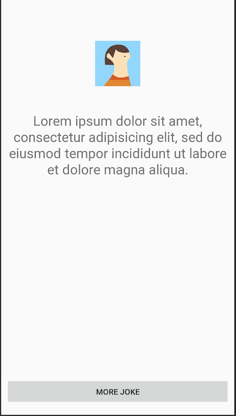

# Membuat Layout UI

- Buatlah layout UI, dengan tiga buah komponen.

| View      | Id                 |
| ---       | ---                |
| ImageView | `@+id/image_icon`  |
| TextView  | `@+id/text_joke`   |
| Button    | `@+id/button_more` |

- Sesuaikan dengan desain berikut.

  

