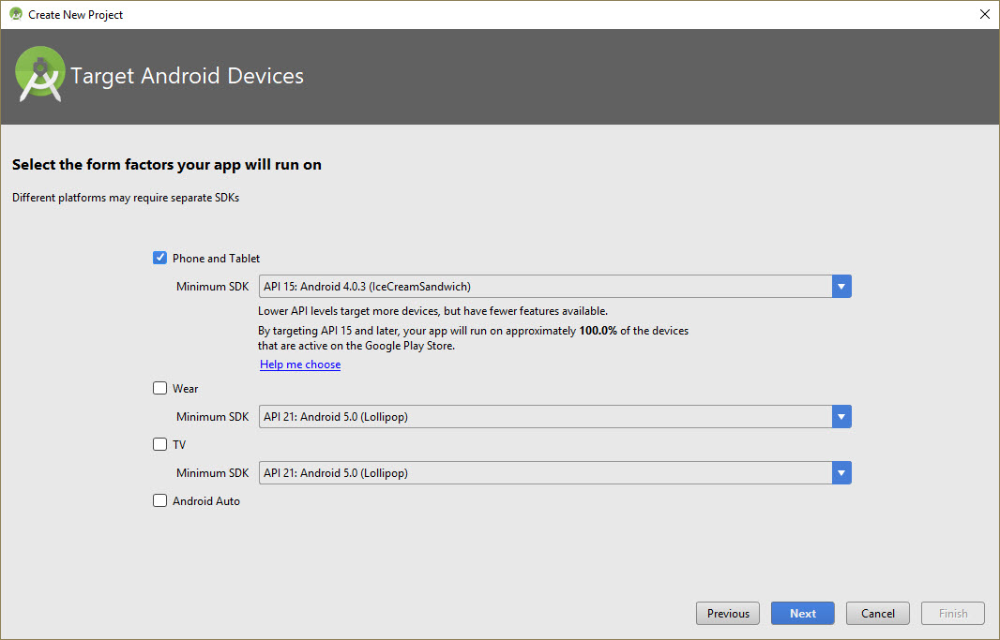
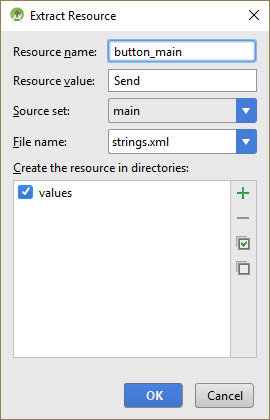
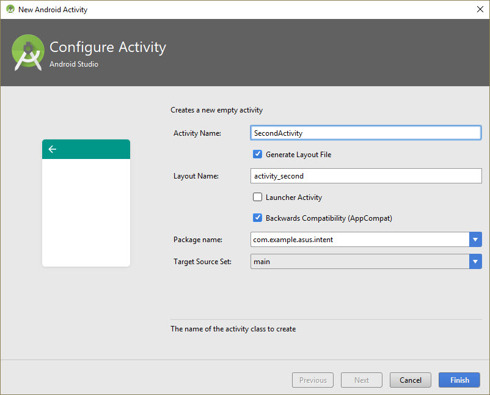
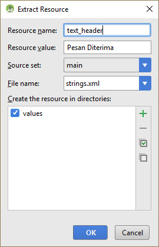
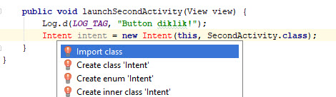
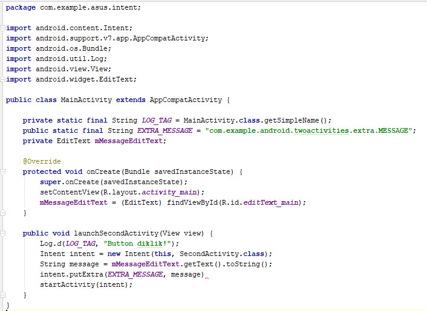
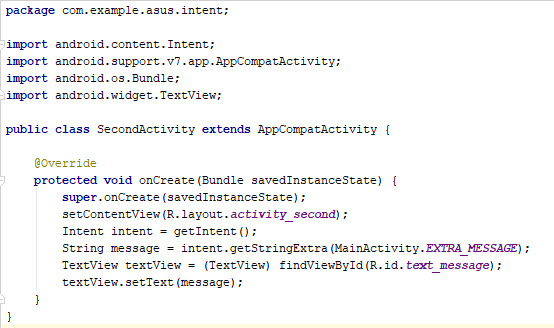
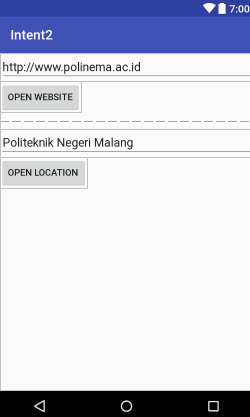
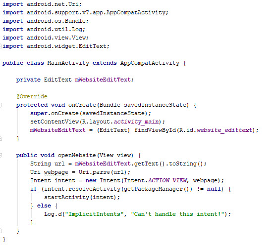
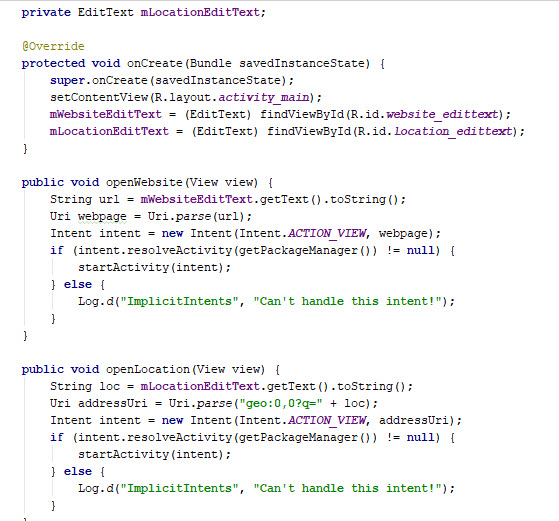

# Intent

## Kemampuan akhir yang diharapkan

Setelah melakukan praktikum ini mahasiswa mampu :

1. Membuat Aplikasi Android untuk Mengirim Data antar Activity
2. Membuat Aplikasi Android dengan Memanfaatkan Defined Action

## Praktikum 1 - Mengirim Data antar Activity (Explicit Intent)

#### Membuat Activity Pertama
1. Buka aplikasi Android Studio dan buat sebuah project baru. Nama aplikasi bisa diisikan sesuai dengan keinginan


2. Pilihlah minimum sdk sesuai kebutuhan, misalnya pada praktikum ini kita gunakan API 15: Android 4.0.3



3. Pilih Empty Activity untuk template project

4. Terima nama aktivitas default (MainActivity). Pastikan kotak Generate Layout file dicentang, kemudian klik Finish

5. Buka `res/layout/activity_main.xml`. Pada Layout Editor, klik tab Design di bagian bawah layar. Ubah layout yang digunakan menjadi **RelativeLayout**

6. Hapus TextView yang berbunyi "*Hello World*"

7. Tambahkan sebuah Plain Text. Beralih ke XML Editor (klik tab Text) dan modifikasi atribut Plain Text sebagai berikut:

Atribut |Nilai
---|---
android:id |"@+id/editText_main"
android:layout_width |"match_parent"
android:layout_height |"wrap_content"
android:layout_toLeftOf |"@+id/button_main"
android:layout_toStartOf |"@+id/button_main"
android:layout_alignParentBottom |"true"
android:hint |"Masukkan pesan"

Jika terdapat kesalahan, abaikan sementara kesalahan yang muncul tersebut. Masalah ini akan kita atasi di langkah selanjutnya.

8. Letakkan kursor pada kata `"Ketikkan pesan"`. Tekan **Alt+Enter** (**Option+Enter** di Mac), dan pilih **Extract string resources**.


9. Ubah nama Sumber Daya menjadi `editText_main` dan klik OK.


Proses ini membuat sumber daya string dalam file `values/res/string.xml`, dan string dalam kode Anda digantikan
dengan referensi ke sumber daya string tersebut.

10. Tambahkan sebuah Button ke layout dalam posisi apa pun. Beralih ke XML Editor (klik tab Text) dan modifikasi atribut Button sebagai berikut:

Atribut| Nilai
---|---
android:id |"@+id/button_main"
android:layout_width |"wrap_content"
android:layout_height |"wrap_content"
android:layout_alignParentRight |"true"
android:layout_alignParentBottom |"true"
android:layout_alignParentEnd |"true"
android:text |"Send"
android:onClick |"launchSecondActivity"

11. Letakkan kursor pada kata `"Send"`. Tekan **Alt+Enter** (**Option+Enter** di Mac), dan pilih **Extract string resources**.


12. Ubah nama Sumber Daya menjadi `button_main` dan klik OK.



Kode Program secara keseluruhan untuk activity_main.xml seperti gambar di bawah ini.


13. Dalam Editor XML, letakkan kursor pada kata `"launchSecondActivity"`. Tekan **Alt+Enter** (**Option+Enter** di Mac) dan pilih **Create 'launchSecondActivity(View)' in 'MainActivity**.


File MainActivity.java terbuka, dan Android Studio membuat metode kerangka untuk handler `onClick`.

14. Dalam `launchSecondActivity`, tambahkan pernyataan log yang bernama "*Button diklik!*"

```java
Log.d(LOG_TAG, "Button clicked!");
```

Log dan LOG_TAG akan terlihat berwarna merah. Definisi untuk variabel tersebut akan ditambahkan dalam langkah
selanjutnya.

15. Tempatkan kursor pada kata "Log" dan tekan **Alt+Enter** (**Option+Enter** di Mac). Android Studio menambahkan
pernyataan impor untuk `android.util.Log`.


16. Pada bagian atas kelas, tambahkan konstanta untuk variabel LOG_TAG:

```java
private static final String LOG_TAG = MainActivity.class.getSimpleName();
```

Konstanta ini menggunakan nama kelas itu sendiri sebagai tag-nya.

Kode Program secara keseluruhan untuk MainActivity.java seperti gambar di bawah ini.


#### Membuat Activity Kedua

1. Klik folder app untuk proyek Anda dan pilih **File > New > Activity > Empty Activity**.

2. Namakan aktivitas baru "SecondActivity." Pastikan Generate Layout File dicentang, dan nama layout akan diisi
dengan activity_second.



3. Klik Finish. Android Studio menambahkan layout aktivitas baru (activity_second) dan file Java baru (SecondActivity)
ke proyek Anda untuk aktivitas baru tersebut. Ini juga akan memperbarui manifes Android untuk menyertakan aktivitas
baru.

4. Buka `manifests/AndroidManifest.xml`.

5. Temukan elemen `<activity>` yang dibuat Android Studio untuk aktivitas kedua.

`<activity android:name=".SecondActivity"></activity>`

6. Tambahkan atribut ini ke elemen `<activity>`:

Atribut |Nilai
---|---
android:label |"Second Activity"
android:parentActivityName |".MainActivity"

Atribut `label` menambahkan judul aktivitas ke bilah tindakan.
Atribut `parentActivityName` menandakan bahwa aktivitas utama adalah induk aktivitas kedua.

7. Tempatkan kursor di "Second Activity" dan tekan **Alt+Enter** (**Option+Enter** di Mac).

8. Pilih **Extract string resource**, namakan sumber daya "activity2_name", dan klik OK. Android Studio menambahkan
sumber daya string untuk label aktivitas.


9. Tambahkan elemen `<meta-data>` element inside the `<activity>` di dalam elemen untuk aktivitas kedua. Gunakan
atribut berikut ini:

Atribut |Nilai
---|---
android:name |"android.support.PARENT_ACTIVITY"
android:value |"com.example.asus.intent.MainActivity" (disesuaikan dengan nama aplikasi yang dibuat)

Kode Program secara keseluruhan untuk AndroidManifest.xml seperti gambar di bawah ini.


10. `Buka res/layout/activity_second.xml`. Ubah layout yang digunakan menjadi **RelativeLayout**

11. Tambahkan TextView ("Plain Textview" dalam Layout Editor). Berikan atribut berikut pada TextView:

Atribut |Nilai
---|---
android:id |"@+id/text_header"
android:layout_width |"wrap_content"
android:layout_height |"wrap_content"
android:text |"Pesan Diterima"
android:textAppearance |"?android:attr/textAppearanceMedium"
android:textStyle |"bold"

Nilai textAppearance adalah atribut bertema Android yang mendefinisikan gaya font dasar font kecil, medium, dan
besar. Anda akan mempelajari selengkapnya tentang tema pada pelajaran berikutnya.

12. Ekstrak string "Pesan Diterima" ke sumber daya bernama text_header.



13. Tambahkan TextView yang kedua (Plain Textview dalam Layout Editor). Berikan atribut berikut pada TextView:

Atribut |Nilai
---|---
android:id |"@+id/text_message"
android:layout_width |"wrap_content"
android:layout_height |"wrap_content"
android:layout_below "@+id/text_header"
android:textSize "?android:attr/textAppearanceMedium"

Kode Program secara keseluruhan untuk activity_second.xml seperti gambar di bawah ini.


#### Menambahkan Intent

Dalam aktivitas ini, kita akan menambahkan intent eksplisit ke aktivitas utama. Intent ini digunakan untuk mengaktifkan
aktivitas kedua saat tombol Send diklik.

1. Buka file MainActivity.java

2. Buat intent baru dalam metode `launchSecondActivity()`.

Konstruktor intent memerlukan dua argumen untuk intent eksplisit: konteks Aplikasi dan komponen spesifik yang akan
menerima intent tersebut. Di sini kita harus menggunakan `this` sebagai konteksmya, dan `SecondActivity.class`
sebagai kelas spesifiknya.

```java
Intent intent = new Intent(this, SecondActivity.class);
```

3. Tempatkan kursor di intent dan tekan **Alt+Enter** (**Option+Enter** di Mac) untuk menambahkan impor ke kelas intent.



4. Panggil metode `startActivity()` dengan intent baru sebagai argumennya.

```java
startActivity(intent);
```

5. Tambahkan konstanta publik di bagian atas kelas untuk mendefinisikan kunci untuk ekstra intent:

```java
public static final String EXTRA_MESSAGE = "com.exmple.asus.intent.extra.MESSAGE";
```

6. Tambahkan variabel privat di bagian atas kelas untuk menampung objek EditText. Mengimpor kelas EditText.

```java
private EditText mMessageEditText;
```

7. Dalam metode `onCreate()`, gunakan **findViewByID** untuk mendapatkan referensi tentang contoh EditText dan
menetapkannya ke variabel privat tersebut:

```java
mMessageEditText = (EditText) findViewById(R.id.editText_main);
```

5. Dalam metode `launchSecondActivity()`, di bawah intent baru, dapatkan teks dari EditText sebagai string:

```java
String message = mMessageEditText.getText().toString();
```

6. Tambahkan string tersebut ke intent sebagai sebuah ekstra dengan konstanta EXTRA_MESSAGE sebagai kunci dan
string-nya sebagai nilai:

```java
intent.putExtra(EXTRA_MESSAGE, message);
```

Kode Program secara keseluruhan untuk MainActivity.java seperti gambar di bawah ini.



7. Buka file SecondActivity.java

8. Dalam metode `onCreate()`, dapatkan intent yang mengaktifkan aktivitas berikut ini:

```java
Intent intent = getIntent();
```

9. Dapatkan string berisi pesan dari ekstra intent menggunakan variabel statis `MainActivity.EXTRA_MESSAGE` sebagai
kuncinya:

```java
String message = intent.getStringExtra(MainActivity.EXTRA_MESSAGE);
```

10. Gunakan findViewByID untuk mendapatkan referensi ke TextView untuk pesan dari layout (Anda mungkin perlu
mengimpor kelas TextView):

```java
TextView textView = (TextView) findViewById(R.id.text_message);
```

11. Atur teks TextView tersebut ke string dari ekstra intent:

```java
textView.setText(message);
```

Kode Program secara keseluruhan untuk SecondActivity.java seperti gambar di bawah ini.



12. Lakukan kompilasi program ke device android anda kemudian perhatikan apa yang terjadi di aplikasi tersebut. Buat kesimpulannya!


## Praktikum 2 - Memanfaatkan Defined Action (Implicit Intent)

#### Membuat Layout
1. Buka aplikasi Android Studio dan buat sebuah project baru. Nama aplikasi bisa diisikan sesuai dengan keinginan

2. Pilihlah minimum sdk sesuai kebutuhan, misalnya pada praktikum ini kita gunakan API 15: Android 4.0.3

3. Pilih Empty Activity untuk template project

4. Terima nama aktivitas default (MainActivity). Pastikan kotak Generate Layout file dicentang, kemudian klik Finish

5. Buka file `res/values/strings.xml` dan tambahkan sumber daya string berikut ini:
<string name="edittext_uri">http://www.polinema.ac.id</string>
<string name="button_uri">Open Website</string>
<string name="edittext_loc">Politeknik Negeri Malang</string>
<string name="button_loc">Open Location</string>

6. Ubah RelativeLayout default ke LinearLayout. Tambahkan atribut android:orientation dan berikan nilai "vertical."

7. Buka `res/layout/activity_main.xml`. Pada Layout Editor, klik tab Design di bagian bawah layar. Ubah layout yang digunakan menjadi **LinearLayout**

8. Tambahkan 2 Plain Text (Edit Text) dan 2 Button dengan tampilan seperti gambar berikut.



9. Atur atribut dari Edit Text dan Button tersebut seperti contoh berikut.


#### Mengimplementasikan Buka Situs Website

Kita akan mengimplementasikan metode handler on-click untuk tombol pertama dalam layout ("Open Website.") Tindakan ini menggunakan intent implisit untuk mengirimkan URI yang diberikan ke aktivitas yang dapat menangani intent implisit tersebut (seperti browser web).

1. Buka file MainActivity.java.

2. Tambahkan variabel privat di bagian atas kelas untuk menampung objek EditText untuk URI situs web.

```java
private EditText mWebsiteEditText;
```

3. Dalam metode `onCreate()`, gunakan findViewByID() untuk mendapatkan referensi tentang instance EditText dan
menetapkannya ke variabel privat tersebut

```java
mWebsiteEditText = (EditText) findViewById(R.id.website_edittext);
```

4. Buat metode baru bernama openWebsite()

```java
public void openWebsite(View view) { }
```

5. Dapatkan nilai string EditText menggunakan kode berikut.

```java
String url = mWebsiteEditText.getText().toString();
```

6. Enkode dan parse string ke dalam objek Uri

```java
Uri webpage = Uri.parse(url);
```

7. Buat intent baru dengan Intent.ACTION_VIEW sebagai tindakan dan URI sebagai data

```java
Intent intent = new Intent(Intent.ACTION_VIEW, webpage);
```

Konstruktor intent ini berbeda dari yang kita gunakan untuk membuat explicit intent. Dalam konstruktor sebelumnya, kita menetapkan konteks saat ini dan komponen spesifik (class aktivitas) untuk mengirim intent. Dalam konstruktor ini kita menetapkan tindakan dan data untuk tindakan tersebut. Tindakan didefinisikan oleh class intent dan dapat menyertakan ACTION_VIEW (untuk melihat data yang diberikan), ACTION_EDIT (untuk mengedit data yang diberikan), atau ACTION_DIAL (untuk menghubungi nomor telepon). Dalam hal ini, tindakan adalah ACTION_VIEW karena kita ingin membuka dan melihat laman web yang ditetapkan oleh URI dalam variabel laman web.

8. Gunakan resolveActivity() dan pengelola paket Android untuk menemukan aktivitas yang dapat menangani intent
implisit. Periksa untuk memastikan permintaan berhasil diatasi.

```java
if (intent.resolveActivity(getPackageManager()) != null) {
}
```

Permintaan yang cocok dengan tindakan intent dan data dengan intent Anda ini memfilter aplikasi yang dipasang pada
perangkat untuk memastikan paling tidak ada satu aktivitas yang bisa menangani permintaan Anda.

9. Dalam pernyataan if, panggil `startActivity()` untuk mengirimkan intent.

```java
startActivity(intent);
```

10. Tambahkan blok else untuk mencetak pesan log jika intent tidak bisa diatasi.

```java
} else {
Log.d("ImplicitIntents", "Can't handle this!");
}
```

Kode Program secara keseluruhan untuk MainActivity.java seperti gambar di bawah ini.



11. Lakukan kompilasi program ke device android anda kemudian perhatikan apa yang terjadi di aplikasi tersebut. Buat kesimpulannya!


#### Mengimplementasikan Buka Lokasi

Kita akan mengimplementasikan metode handler on-click untuk tombol kedua dalam UI ("Open Location"). Metode ini hampir identik dengan metode openWebsite(). Perbedaannya adalah penggunaan URI geo untuk menunjukkan lokasi peta. Anda bisa menggunakan URI geo dengan lintang dan bujur, atau gunakan string kueri untuk lokasi umum. Dalam contoh ini kami telah menggunakannya untuk tujuan yang kedua.

1. Buka file MainActivity.java.

2. Tambahkan variabel privat di bagian atas kelas untuk menampung objek EditText bagi URI lokasi.

```java
private EditText mLocationEditText;
```

3. Dalam metode `onCreate()`, gunakan findViewByID() untuk mendapatkan referensi tentang instance EditText dan
menetapkannya ke variabel privat tersebut

```java
mLocationEditText = (EditText) findViewById(R.id.location_edittext);
```

4. Buat metode baru bernama openLocation untuk digunakan sebagai metode onClick untuk tombol Open Location.

5. Dapatkan nilai string EditText mLocationEditText.

```java
String loc = mLocationEditText.getText().toString();
```

6. Parse string itu ke dalam objek Uri dengan kueri penelusuran geo:

```java
Uri addressUri = Uri.parse("geo:0,0?q=" + loc);
```

7. Buat intent baru dengan Intent.ACTION_VIEW sebagai tindakan dan loc sebagai datanya.

```java
Intent intent = new Intent(Intent.ACTION_VIEW, addressUri);
```

8. Pecahkan intent dan periksa untuk memastikan intent berhasil diatasi. Jika demikian, `startActivity()`, jika tidak catat log
pesan kesalahan.

```java
if (intent.resolveActivity(getPackageManager()) != null) {
startActivity(intent);
} else {
Log.d("ImplicitIntents", "Can't handle this intent!");
}
```

Kode Program secara keseluruhan untuk MainActivity.java seperti gambar di bawah ini.



9. Lakukan kompilasi program ke device android anda kemudian perhatikan apa yang terjadi di aplikasi tersebut. Buat kesimpulannya!

## Latihan

Buatlah sebuah aplikasi Android untuk proses Registrasi yang terdiri dari dua activity. Pada activity pertama, terdapat 3 Edit Text (Nama, Alamat, dan No. Hp) dan 1 Button (Register). Pada saat Button diklik, activity kedua akan muncul dengan menampilkan Nama dan Alamat sesuai isian sebelumnya. Selain itu, pada activity kedua juga terdapat sebuah Button (Share). Apabila Button tersebut diklik, maka data Nama dan Alamat akan di-share.
