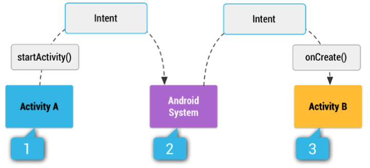

#Kmampuan Akhir Yang Direncanakan

- Mahasiswa dapat memahami fungsi intent
- Mahasiswa dapat menggunakan fungsi intent pada Android Studio

#Teori
Intent adalah mekanisme untuk melakukan Action pada komponen dalam satu aplikasi yang sama maupun aplikasi lain. Intent, dalam membuat aplikasi terkadang membutuhkan banyak activity. Sederhananya setiap activity dapat berinteraksi dengan activity lain. Saat membuat activity, untuk berpindah dari suatu activity ke activity lain secara general dapat menggunakan intent, secara umum kurang lebih intent digunakan seperti berikut.


```
Intent intent =  new Intent (this, Main2Activity.class);
startActivity(intent);
```


Gambar 1. Ilustrasi Intent

#Pemanfaatan Intent sebagai berikut :
* Untuk berpindah halaman dari satu Activity ke Activity lain dengan atau tanpa data

* Untuk menjalankan background Service misal dibutuhkan sebuah proses service untuk
mengambil lokasi pengguna, download file atau sikronisasi ke server

* Untuk menyampaikan sebuah objek dari komponen Broadcast misal jika ingin
mengetahui jika device Android sudah selesai booting setelah diaktifkan


# Explicit dan Implicit Intent
* Explicit Intent
Untuk mengaktifkan komponen-komponen dalam satu aplikasi yang sama misal :
Berpindah Activity atau mengaktifkan service untuk mendownload file secara
background
* Implicit Intent
Untuk mengaktikan komponen dari aplikasi lain. Misal : mengaktifkan dial phone pada aplikasi Telp, mengaktifkan driving direction pada Google Maps atau mengirimkan pesan
via Gmail, sms atau aplikasi lainnya.


# Modul


# Tugas
