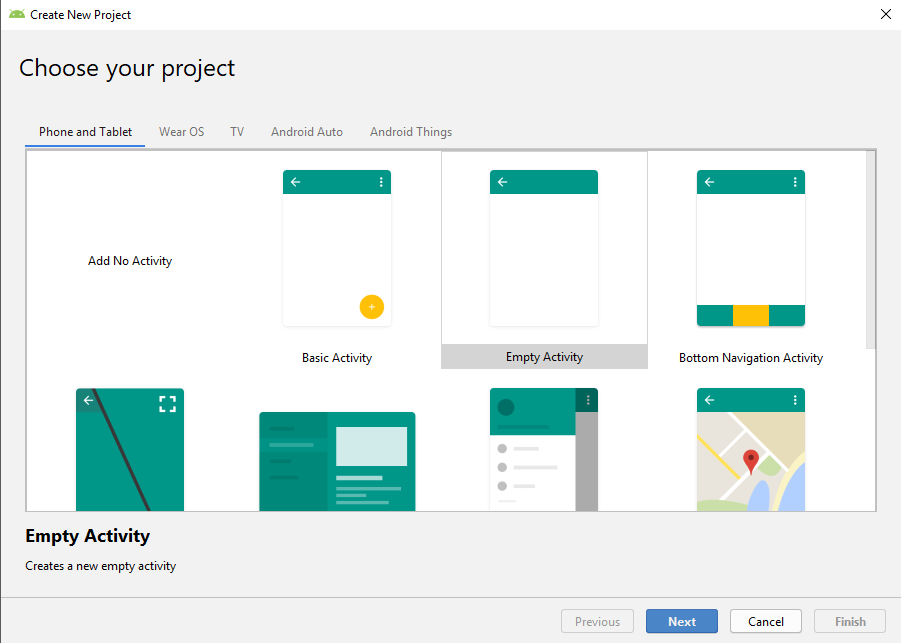
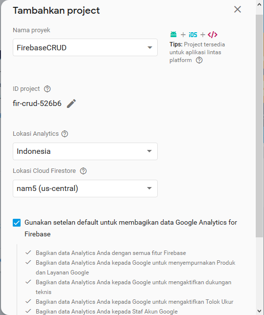
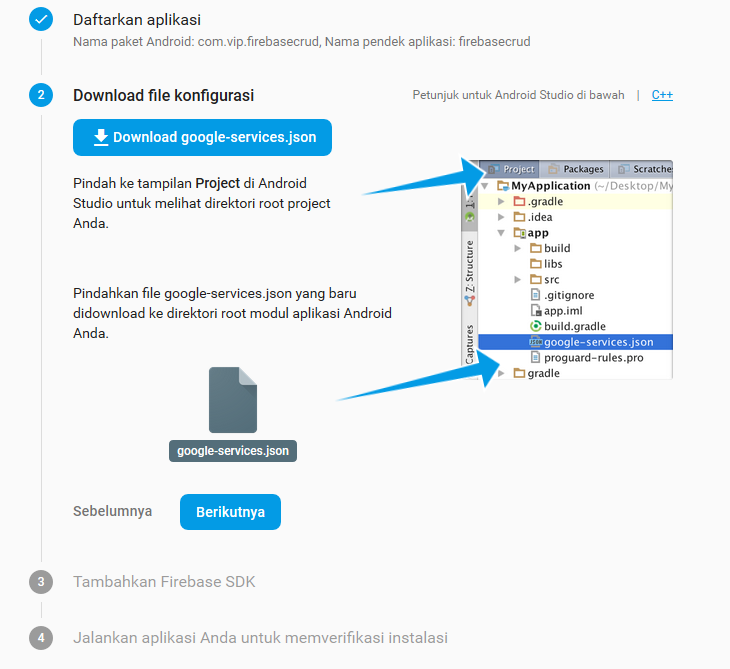
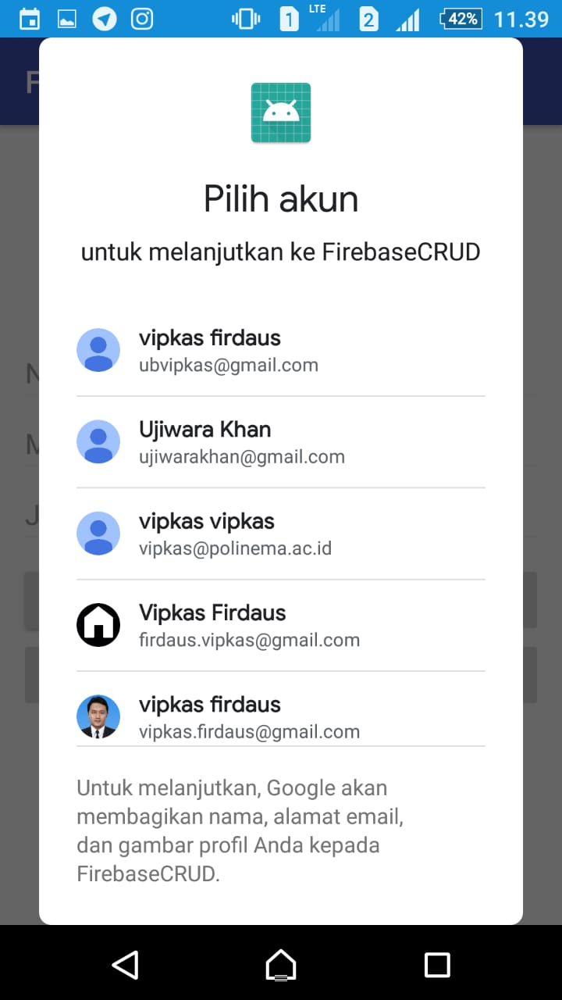
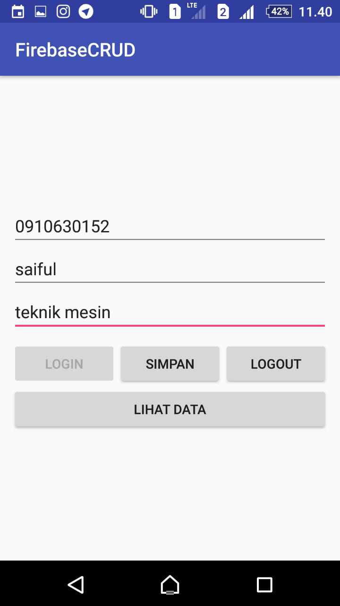
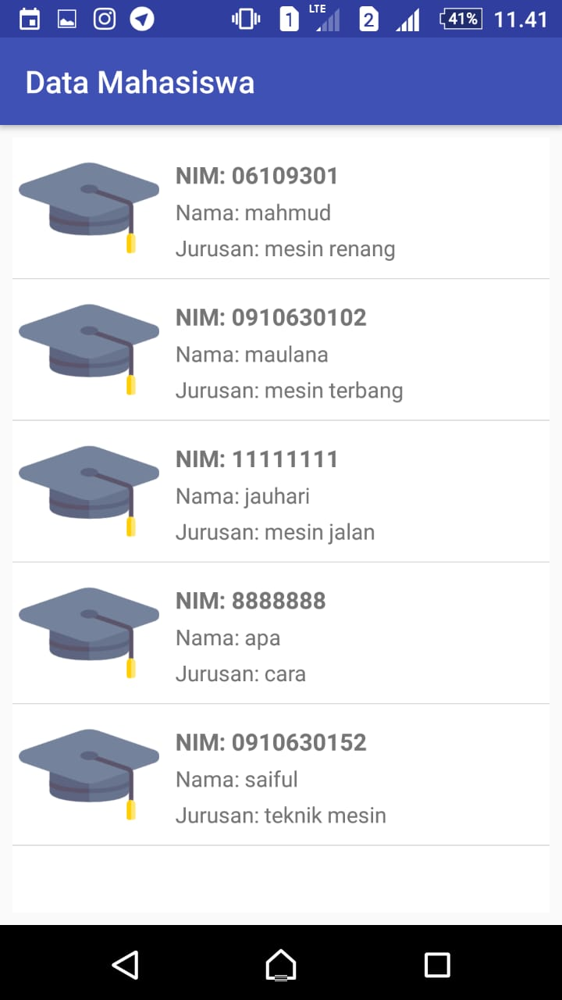
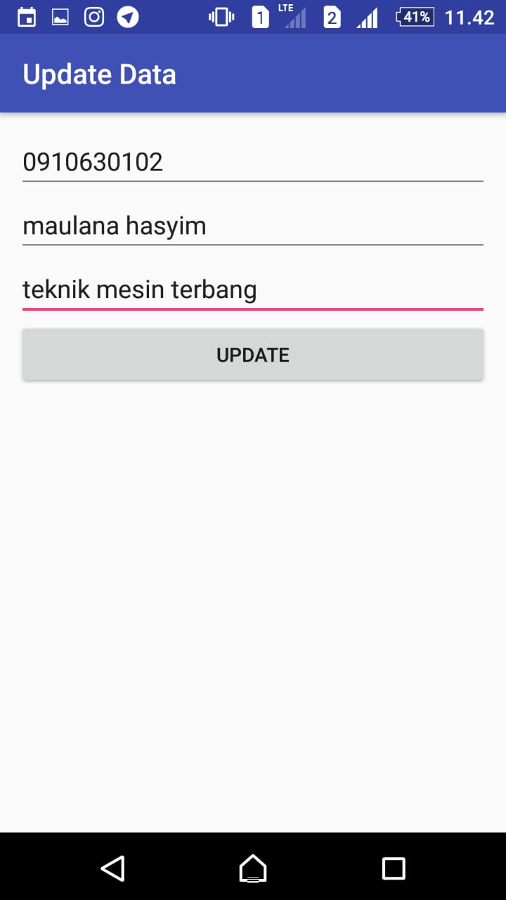

# Firebase CRUD

## Kemampuan akhir yang diharapkan

Setelah melakukan praktikum ini mahasiswa mampu :

1.	Membuat realtime database dan authentication pada firebase
2.	Melakukan sinkronisasi firebase realtime database dengan aplikasi android
3.	Membuat apikasi CRUD menggunakan firebase realtime database

## Dasar Teori

Firebase adalah suatu layanan dari google untuk mempermudah para pengembang-pengembang aplikasi untuk mengembangkan aplikasinya. **Firebase(BaaS ‘Backend as a Service’)** ini merupakan solusi yang ditawarkan oleh Google untuk mempermudah pekerjaan Developer. Dengan adanya Firebase, apps developer dapat fokus mengembangkan aplikasi tanpa harus memberikan usaha yang besar terkait pengelolaan backend.

### 1. Firebase Realtime Database 
Firebase Realtime Database adalah sebuah cloud based NoSQL database yang tersedia secara realtime dan bisa diakses cross platform baik dari Android, iOS, maupun Web. Data pada Firebase Realtime Database disimpan dalam bentuk JSON tree yang selalu tersinkron secara realtime. Karena sifatnya yang realtime, jika ada perubahan pada database, maka semua klien yang menggunakan Realtime Database ini akan tersinkron secara otomatis. Dan juga jenis database-nya yang bertipe NoSQL, sangat cocok ketika kita ingin menyimpan data bersifat key-value pada aplikasi.
### 2. Firebase Authentication
Firebase authentication memberikan fungsi dalam mengelelola akun pengguna dengan cara yang mudah dan aman. Firebase Auth menawarkan beberapa metode autentikasi, termasuk email/sandi, penyedia pihak ketiga seperti Google atau Facebook, atau langsung menggunakan sistem akun Anda yang sudah ada.

## Praktikum

### A. Menambahkan Firebase pada project aplikasi Android

1. Pada langkah pertama buat project baru dengan empty activity, seperti gambar berikut:




2. Pada langkah berikutnya login/masuk pada Firebase dengan menggunakan Alamat Gmail pada link berikut ini https://firebase.google.com/?hl=id kemudian pilih `Buka Konsol`


3. Selanjutnya tambahkan project baru kita kedalam Firebase Console, dengan mengklik `Tambahkan proyek(+)`


4. Isi nama proyek, ID project dan Negara/Wilayah kalian, setelah itu klik `Buat Proyek`



5. Pada halaman Dashboard Firebase, disini pilih platform yang akan digunakan, klik icon berlogo android, untuk menambahkan Firebase ke dalam aplikasi Android.


6. Isi nama package (wajib), nama pendek aplikasi (jika diperlukan), lalu masukan kode SHA-1 kedalam Firebase.


Untuk mendapatkan SHA-1 fingerprint, lakukan langkah-langkah berikut:

* Buka kembali project Android Studio

* Klik tab **Gradle** yang berada di sebelah kanan jendela Android Studio. Jika tidak ada isi apapun yang ditampilkan, klik **Refresh all Gradle projects** di bagian pojok kiri jendela Gradle

* Cari dan klik nama project kalian

* Masuk ke `Tasks` - `android` - `signingReport`


* Klik dua kali pada **SigningReport** sehingga console terbuka

* Tunggu hingga proses selesai dan informasi SHA-1 akan ditampilkan. Salin kode SHA-1 tersebut ke halaman Firebase


7. Download File Konfigurasi **google-services.json**, setelah selesai, pindahkan file tersebut pada direktori `app/root` yang terdapat pada project aplikasi.



8. Tambahkan Firebase SDK pada file `build.gradle(Project-Level)`, masukan plugin dibawah ini:

```java
dependencies {
    classpath 'com.android.tools.build:gradle:3.3.2'
    classpath 'com.google.gms:google-services:3.2.0'
    

    // NOTE: Do not place your application dependencies here; they belong
    // in the individual module build.gradle files
}
```

9. Buka `bulid.gradle(app-level)` lalu tambahkan library di bawah ini dalam dependencies.

```java
dependencies {
    implementation fileTree(dir: 'libs', include: ['*.jar'])
    implementation 'com.android.support:appcompat-v7:27.0.2'
    implementation 'com.android.support.constraint:constraint-layout:1.1.0'
    implementation 'com.android.support:design:27.0.2'
    implementation 'com.android.support:recyclerview-v7:27.0.2'
    implementation 'com.android.support:support-v4:27.0.2'
    implementation 'com.google.firebase:firebase-core:11.8.0'
    implementation 'com.firebaseui:firebase-ui-auth:3.2.2'
    implementation 'com.google.firebase:firebase-database:11.8.0'
    implementation 'com.google.android.gms:play-services-auth:11.8.0'    
    testImplementation 'junit:junit:4.12'
    androidTestImplementation 'com.android.support.test:runner:1.0.1'
    androidTestImplementation 'com.android.support.test.espresso:espresso-core:3.0.1'
}
```

10. Lalu tambahkan kode **apply plugin: 'com.google.gms.google-services'** di bagian bawah dependencies.

```java
dependencies {
    implementation fileTree(dir: 'libs', include: ['*.jar'])
    implementation 'com.android.support:appcompat-v7:27.0.2'
    implementation 'com.android.support.constraint:constraint-layout:1.1.0'
    implementation 'com.android.support:design:27.0.2'
    implementation 'com.android.support:recyclerview-v7:27.0.2'
    implementation 'com.android.support:support-v4:27.0.2'
    implementation 'com.google.firebase:firebase-core:11.8.0'
    implementation 'com.firebaseui:firebase-ui-auth:3.2.2'
    implementation 'com.google.firebase:firebase-database:11.8.0'
    implementation 'com.google.android.gms:play-services-auth:11.8.0'    
    testImplementation 'junit:junit:4.12'
    androidTestImplementation 'com.android.support.test:runner:1.0.1'
    androidTestImplementation 'com.android.support.test.espresso:espresso-core:3.0.1'
}
apply plugin: 'com.google.gms.google-services'
```

### B. Membuat Fitur Create, Read, Update, dan Delete Data pada Firebase

1. Buka layout `activity_main.xml` untuk membuat halaman menu aplikasinya terlebih dahulu dengan menyalin kode berikut.

```java
<?xml version="1.0" encoding="utf-8"?>
<RelativeLayout xmlns:android="http://schemas.android.com/apk/res/android"
    xmlns:app="http://schemas.android.com/apk/res-auto"
    xmlns:tools="http://schemas.android.com/tools"
    android:layout_width="match_parent"
    android:layout_height="match_parent"
    android:layout_margin="12dp"
    tools:context="com.vip.firebasecrud.ui.MainActivity">

    <ProgressBar
        android:id="@+id/progress"
        style="?android:attr/progressBarStyle"
        android:layout_width="wrap_content"
        android:layout_height="wrap_content"
        android:layout_alignParentEnd="false"
        android:layout_alignParentLeft="false"
        android:layout_alignParentRight="false"
        android:layout_alignParentStart="false"
        android:layout_alignParentTop="false"
        android:layout_centerHorizontal="true"
        android:layout_centerVertical="true" />

    <LinearLayout
        android:layout_width="match_parent"
        android:layout_height="match_parent"
        android:gravity="center"
        android:orientation="vertical">

        <EditText
            android:id="@+id/nim"
            android:layout_width="match_parent"
            android:layout_height="wrap_content"
            android:ems="10"
            android:hint="NIM"
            android:inputType="textPersonName" />

        <EditText
            android:id="@+id/nama"
            android:layout_width="match_parent"
            android:layout_height="wrap_content"
            android:ems="10"
            android:hint="Masukan Nama"
            android:inputType="textPersonName" />

        <EditText
            android:id="@+id/jurusan"
            android:layout_width="match_parent"
            android:layout_height="wrap_content"
            android:ems="10"
            android:hint="Jurusan"
            android:inputType="textPersonName" />

        <LinearLayout
            android:layout_width="match_parent"
            android:layout_height="wrap_content"
            android:layout_marginTop="8dp"
            android:orientation="horizontal">

            <Button
                android:id="@+id/login"
                android:layout_width="match_parent"
                android:layout_height="wrap_content"
                android:layout_weight="1"
                android:text="Login" />

            <Button
                android:id="@+id/save"
                android:layout_width="match_parent"
                android:layout_height="wrap_content"
                android:layout_weight="1"
                android:text="Simpan" />

            <Button
                android:id="@+id/logout"
                android:layout_width="match_parent"
                android:layout_height="wrap_content"
                android:layout_weight="1"
                android:text="Logout" />

        </LinearLayout>

        <Button
            android:id="@+id/showdata"
            android:layout_width="match_parent"
            android:layout_height="wrap_content"
            android:text="Lihat Data" />

    </LinearLayout>

</RelativeLayout>
```

2. Tambahkan kode berikut ini pada `MainActivity.java`

```java
public class MainActivity extends AppCompatActivity implements View.OnClickListener{

    //Deklarasi Variable
    private ProgressBar progressBar;
    private EditText NIM, Nama, Jurusan;
    private FirebaseAuth auth;
    private Button Logout, Simpan, Login, ShowData;

    //Membuat Kode Permintaan
    private int RC_SIGN_IN = 1;

    @Override
    protected void onCreate(Bundle savedInstanceState) {
        super.onCreate(savedInstanceState);
        setContentView(R.layout.activity_main);
        progressBar = findViewById(R.id.progress);
        progressBar.setVisibility(View.GONE);

        //Inisialisasi ID (Button)
        Logout = findViewById(R.id.logout);
        Logout.setOnClickListener(this);
        Simpan = findViewById(R.id.save);
        Simpan.setOnClickListener(this);
        Login = findViewById(R.id.login);
        Login.setOnClickListener(this);
        ShowData = findViewById(R.id.showdata);
        ShowData.setOnClickListener(this);

        auth = FirebaseAuth.getInstance(); //Mendapakan Instance Firebase Autentifikasi

        //Inisialisasi ID (EditText)
        NIM = findViewById(R.id.nim);
        Nama = findViewById(R.id.nama);
        Jurusan = findViewById(R.id.jurusan);

        /*
         * Mendeteksi apakah ada user yang masuk, Jika tidak, maka setiap komponen UI akan dinonaktifkan
         * Kecuali Tombol Login. Dan jika ada user yang terautentikasi, semua fungsi/komponen
         * didalam User Interface dapat digunakan, kecuali tombol Logout
         */
        if(auth.getCurrentUser() == null){
            defaultUI();
        }else {
            updateUI();
        }
    }

    //Tampilan Default pada Activity jika user belum terautentikasi
    private void defaultUI(){
        Logout.setEnabled(false);
        Simpan.setEnabled(false);
        ShowData.setEnabled(false);
        Login.setEnabled(true);
        NIM.setEnabled(false);
        Nama.setEnabled(false);
        Jurusan.setEnabled(false);
    }

    //Tampilan User Interface pada Activity setelah user Terautentikasi
    private void updateUI(){
        Logout.setEnabled(true);
        Simpan.setEnabled(true);
        Login.setEnabled(false);
        ShowData.setEnabled(true);
        NIM.setEnabled(true);
        Nama.setEnabled(true);
        Jurusan.setEnabled(true);
        progressBar.setVisibility(View.GONE);
    }

    // Mengecek apakah ada data yang kosong
    private boolean isEmpty(String s){
        return TextUtils.isEmpty(s);
    }

    protected void onActivityResult(int requestCode, int resultCode, Intent data) {
        super.onActivityResult(requestCode, resultCode, data);
        // RC_SIGN_IN adalah kode permintaan yang Anda berikan ke startActivityForResult, saat memulai masuknya arus.
        if (requestCode == RC_SIGN_IN) {

            //Berhasil masuk
            if (resultCode == RESULT_OK) {
                Toast.makeText(MainActivity.this, "Login Berhasil", Toast.LENGTH_SHORT).show();
                updateUI();
            }else {
                progressBar.setVisibility(View.GONE);
                Toast.makeText(MainActivity.this, "Login Dibatalkan", Toast.LENGTH_SHORT).show();
            }
        }
    }

    @Override
    public void onClick(View v) {
        switch (v.getId()){
            case R.id.login:
                // Statement program untuk login/masuk
                startActivityForResult(AuthUI.getInstance()
                                .createSignInIntentBuilder()

                                //Memilih Provider atau Method masuk yang akan kita gunakan
                                .setAvailableProviders(Collections.singletonList(new AuthUI.IdpConfig.GoogleBuilder().build()))
                                .setIsSmartLockEnabled(false)
                                .build(),
                        RC_SIGN_IN);
                progressBar.setVisibility(View.VISIBLE);
                break;

            case R.id.save:
                //Mendapatkan UserID dari pengguna yang Terautentikasi
                String getUserID = auth.getCurrentUser().getUid();

                //Mendapatkan Instance dari Database
                FirebaseDatabase database = FirebaseDatabase.getInstance();
                DatabaseReference getReference;

                //Menyimpan Data yang diinputkan User kedalam Variable
                String getNIM = NIM.getText().toString();
                String getNama = Nama.getText().toString();
                String getJurusan = Jurusan.getText().toString();

                getReference = database.getReference(); // Mendapatkan Referensi dari Database

                // Mengecek apakah ada data yang kosong
                if(isEmpty(getNIM) || isEmpty(getNama) || isEmpty(getJurusan)){
                    //Jika Ada, maka akan menampilkan pesan singkan seperti berikut ini.
                    Toast.makeText(MainActivity.this, "Data tidak boleh ada yang kosong", Toast.LENGTH_SHORT).show();
                }else {
                    /*
                    Jika Tidak, maka data dapat diproses dan meyimpannya pada Database
                    Menyimpan data referensi pada Database berdasarkan User ID dari masing-masing Akun
                    */
                    getReference.child("Admin").child(getUserID).child("Mahasiswa").push()
                            .setValue(new data_mahasiswa(getNIM, getNama, getJurusan))
                            .addOnSuccessListener(this, new OnSuccessListener() {
                                @Override
                                public void onSuccess(Object o) {
                                    //Peristiwa ini terjadi saat user berhasil menyimpan datanya kedalam Database
                                    NIM.setText("");
                                    Nama.setText("");
                                    Jurusan.setText("");
                                    Toast.makeText(MainActivity.this, "Data Tersimpan", Toast.LENGTH_SHORT).show();
                                }
                            });
                }
                break;

            case R.id.logout:
                // Statement program untuk logout/keluar
                AuthUI.getInstance()
                        .signOut(this)
                        .addOnCompleteListener(new OnCompleteListener() {
                            @Override
                            public void onComplete(@NonNull Task task) {
                                Toast.makeText(MainActivity.this, "Logout Berhasil", Toast.LENGTH_SHORT).show();
                                finish();
                            }
                        });
                break;
        }
    }
}
```

Pada aplikasi ini terdapat empat Button, yaitu **Login, Simpan, Logout, dan Lihat Data**. Penyimpanan data dilakukan pada layout `activity_main.xml` yang terdiri dari tiga EditText sebagai tempat masukan informasi yaitu *NIM, Nama, dan Jurusan*, serta sebuah Button Simpan Data.

3. Selanjutnya, buat model Mahasiswa terlebih dahulu bernama **data_mahasiswa.java** pada `models/data_mahasiswa.java`. Fungsi class ini adalah untuk menyimpan atribut-atribut dari data mahasiswa yang dimasukkan, serta beberapa method *getter* dan *setter*.

```java
public class data_mahasiswa {

    //Deklarasi Variable
    private String nim;
    private String nama;
    private String jurusan;
    private String key;

    public String getKey() {
        return key;
    }

    public void setKey(String key) {
        this.key = key;
    }

    public String getNim() {
        return nim;
    }

    public void setNim(String nim) {
        this.nim = nim;
    }

    public String getNama() {
        return nama;
    }

    public void setNama(String nama) {
        this.nama = nama;
    }

    public String getJurusan() {
        return jurusan;
    }

    public void setJurusan(String jurusan) {
        this.jurusan = jurusan;
    }

    //Membuat Konstuktor kosong untuk membaca data snapshot
    public data_mahasiswa(){
    }

    //Konstruktor dengan beberapa parameter, untuk mendapatkan Input Data dari User
    public data_mahasiswa(String nim, String nama, String jurusan) {
        this.nim = nim;
        this.nama = nama;
        this.jurusan = jurusan;
    }
}
```

Untuk menampilkan data yang sudah disimpan, kita menggunakan RecyclerView sehingga kita perlu membuat layout-layoutnya terlebih dahulu.

4. Buat layout baru bernama **activity_my_list_data.xml** pada `res/layout/`

```java
<?xml version="1.0" encoding="utf-8"?>
<RelativeLayout xmlns:android="http://schemas.android.com/apk/res/android"
    xmlns:app="http://schemas.android.com/apk/res-auto"
    xmlns:tools="http://schemas.android.com/tools"
    android:layout_width="match_parent"
    android:layout_height="match_parent"
    android:layout_margin="8dp"
    android:background="#FFFFFF"
    tools:context="com.vip.firebasecrud.ui.MyListData">

    <android.support.v7.widget.RecyclerView
        android:id="@+id/datalist"
        android:layout_width="match_parent"
        android:layout_height="match_parent"
        android:scrollbars="vertical" />

</RelativeLayout>
```

5. Buat kembali layout baru bernama **view_design.xml** pada `res/layout/`

```java
<?xml version="1.0" encoding="utf-8"?>
<LinearLayout xmlns:android="http://schemas.android.com/apk/res/android"
    xmlns:app="http://schemas.android.com/apk/res-auto"
    android:id="@+id/list_item"
    android:layout_width="match_parent"
    android:layout_height="wrap_content"
    android:background="#FFFFFF"
    android:gravity="center"
    android:orientation="horizontal">

    <ImageView
        android:layout_width="match_parent"
        android:layout_height="90dp"
        android:layout_weight="2.5" />

    <LinearLayout
        android:layout_width="match_parent"
        android:layout_height="wrap_content"
        android:layout_marginLeft="6dp"
        android:layout_marginStart="6dp"
        android:layout_weight="1"
        android:orientation="vertical">

        <TextView
            android:id="@+id/nim"
            android:layout_width="match_parent"
            android:layout_height="wrap_content"
            android:layout_marginTop="4dp"
            android:text="NIM"
            android:textSize="15sp"
            android:textStyle="bold" />

        <TextView
            android:id="@+id/nama"
            android:layout_width="match_parent"
            android:layout_height="wrap_content"
            android:layout_marginTop="4dp"
            android:text="Nama" />

        <TextView
            android:id="@+id/jurusan"
            android:layout_width="match_parent"
            android:layout_height="wrap_content"
            android:layout_marginTop="4dp"
            android:text="Jurusan:" />

    </LinearLayout>

</LinearLayout>
```

Selanjutnya kita perlu membuat class Adapter yang akan digunakan di RecyclerView. Adapter ini berfungsi untuk mengolah data yang kita download dan menampilkannya pada RecyclerView.

6. Buat Recycler View bernama **RecyclerViewAdapter** pada `adapter/RecyclerViewAdapter.java`

```java
//Class Adapter ini Digunakan Untuk Mengatur Bagaimana Data akan Ditampilkan
public class RecyclerViewAdapter extends RecyclerView.Adapter<RecyclerViewAdapter.ViewHolder>{

    //Deklarasi Variable
    private ArrayList<data_mahasiswa> listMahasiswa;
    private Context context;

    //Membuat Interfece
    public interface dataListener{
        void onDeleteData(data_mahasiswa data, int position);
    }

    //Deklarasi objek dari Interfece
    dataListener listener;

    //Membuat Konstruktor, untuk menerima input dari Database
    public RecyclerViewAdapter(ArrayList<data_mahasiswa> listMahasiswa, Context context) {
        this.listMahasiswa = listMahasiswa;
        this.context = context;
        listener = (MyListData)context;
    }

    //ViewHolder Digunakan Untuk Menyimpan Referensi Dari View-View
    class ViewHolder extends RecyclerView.ViewHolder{

        private TextView NIM, Nama, Jurusan;
        private LinearLayout ListItem;

        ViewHolder(View itemView) {
            super(itemView);
            //Menginisialisasi View-View yang terpasang pada layout RecyclerView kita
            NIM = itemView.findViewById(R.id.nim);
            Nama = itemView.findViewById(R.id.nama);
            Jurusan = itemView.findViewById(R.id.jurusan);
            ListItem = itemView.findViewById(R.id.list_item);
        }
    }

    @Override
    public ViewHolder onCreateViewHolder(ViewGroup parent, int viewType) {
        //Membuat View untuk Menyiapkan dan Memasang Layout yang Akan digunakan pada RecyclerView
        View V = LayoutInflater.from(parent.getContext()).inflate(R.layout.view_design, parent, false);
        return new ViewHolder(V);
    }

    @SuppressLint("SetTextI18n")
    @Override
    public void onBindViewHolder(ViewHolder holder, final int position) {
        //Mengambil Nilai/Value yenag terdapat pada RecyclerView berdasarkan Posisi Tertentu
        final String NIM = listMahasiswa.get(position).getNim();
        final String Nama = listMahasiswa.get(position).getNama();
        final String Jurusan = listMahasiswa.get(position).getJurusan();

        //Memasukan Nilai/Value kedalam View (TextView: NIM, Nama, Jurusan)
        holder.NIM.setText("NIM: "+NIM);
        holder.Nama.setText("Nama: "+Nama);
        holder.Jurusan.setText("Jurusan: "+Jurusan);

        //Menampilkan Menu Update dan Delete saat user melakukan long klik pada salah satu item
        holder.ListItem.setOnLongClickListener(new View.OnLongClickListener() {
            @Override
            public boolean onLongClick(final View view) {
                final String[] action = {"Update", "Delete"};
                AlertDialog.Builder alert = new AlertDialog.Builder(view.getContext());
                alert.setItems(action,  new DialogInterface.OnClickListener() {
                    @Override
                    public void onClick(DialogInterface dialog, int i) {
                        switch (i){
                            case 0:
                                /*
                                  Berpindah Activity pada halaman layout updateData
                                  dan mengambil data pada listMahasiswa, berdasarkan posisinya
                                  untuk dikirim pada activity updateData
                                 */
                                Bundle bundle = new Bundle();
                                bundle.putString("dataNIM", listMahasiswa.get(position).getNim());
                                bundle.putString("dataNama", listMahasiswa.get(position).getNama());
                                bundle.putString("dataJurusan", listMahasiswa.get(position).getJurusan());
                                bundle.putString("getPrimaryKey", listMahasiswa.get(position).getKey());
                                Intent intent = new Intent(view.getContext(), updateData.class);
                                intent.putExtras(bundle);
                                context.startActivity(intent);
                                break;
                            case 1:
                                //Menggunakan interface untuk mengirim data mahasiswa, yang akan dihapus
                                listener.onDeleteData(listMahasiswa.get(position), position);
                                break;
                        }
                    }
                });
                alert.create();
                alert.show();
                return true;
            }
        });
    }

    @Override
    public int getItemCount() {
        //Menghitung Ukuran/Jumlah Data Yang Akan Ditampilkan Pada RecyclerView
        return listMahasiswa.size();
    }

}
```

Setelah kita membuat layout untuk Lihat Data, maka kita perlu menambahkan sebuah Activity yang berfungsi untuk membaca data dari Firebase Realtime Database dan kemudian menampilkannya di RecyclerView.

7. Buat sebuah file activity bernama **MyListData.java**

```java
public class MyListData extends AppCompatActivity implements RecyclerViewAdapter.dataListener {

    //Deklarasi Variable untuk RecyclerView
    private RecyclerView recyclerView;
    private RecyclerView.Adapter adapter;
    private RecyclerView.LayoutManager layoutManager;

    //Deklarasi Variable Database Reference dan ArrayList dengan Parameter Class Model kita.
    private DatabaseReference reference;
    private ArrayList<data_mahasiswa> dataMahasiswa;

    private FirebaseAuth auth;

    @Override
    protected void onCreate(Bundle savedInstanceState) {
        super.onCreate(savedInstanceState);
        setContentView(R .layout.activity_my_list_data);
        recyclerView = findViewById(R.id.datalist);
        getSupportActionBar().setTitle("Data Mahasiswa");
        auth = FirebaseAuth.getInstance();
        MyRecyclerView();
        GetData();
    }

    //Berisi baris kode untuk mengambil data dari Database dan menampilkannya kedalam Adapter
    private void GetData(){
        //Mendapatkan Referensi Database
        reference = FirebaseDatabase.getInstance().getReference();
        reference.child("Admin").child(auth.getUid()).child("Mahasiswa")
                 .addValueEventListener(new ValueEventListener() {
            @Override
            public void onDataChange(DataSnapshot dataSnapshot) {
                //Inisialisasi ArrayList
                dataMahasiswa = new ArrayList<>();

                for (DataSnapshot snapshot : dataSnapshot.getChildren()){
                    //Mapping data pada DataSnapshot ke dalam objek mahasiswa
                    data_mahasiswa mahasiswa = snapshot.getValue(data_mahasiswa.class);

                    //Mengambil Primary Key, digunakan untuk proses Update dan Delete
                    mahasiswa.setKey(snapshot.getKey());
                    dataMahasiswa.add(mahasiswa);
                }

                //Inisialisasi Adapter dan data Mahasiswa dalam bentuk Array
                adapter = new RecyclerViewAdapter(dataMahasiswa, MyListData.this);

                //Memasang Adapter pada RecyclerView
                recyclerView.setAdapter(adapter);
            }

            @Override
            public void onCancelled(DatabaseError databaseError) {
              /*
                Kode ini akan dijalankan ketika ada error dan
                pengambilan data error tersebut lalu memprint error nya
                ke LogCat
               */
                Toast.makeText(getApplicationContext(),"Data Gagal Dimuat", Toast.LENGTH_LONG).show();
                Log.e("MyListActivity", databaseError.getDetails()+" "+databaseError.getMessage());
            }
        });
    }

    //Methode yang berisi kumpulan baris kode untuk mengatur RecyclerView
    private void MyRecyclerView(){
        //Menggunakan Layout Manager, Dan Membuat List Secara Vertical
        layoutManager = new LinearLayoutManager(this);
        recyclerView.setLayoutManager(layoutManager);
        recyclerView.setHasFixedSize(true);

        //Membuat Underline pada Setiap Item Didalam List
        DividerItemDecoration itemDecoration = new DividerItemDecoration(getApplicationContext(), DividerItemDecoration.VERTICAL);
        itemDecoration.setDrawable(ContextCompat.getDrawable(getApplicationContext(), R.drawable.line));
        recyclerView.addItemDecoration(itemDecoration);
    }

    @Override
    public void onDeleteData(data_mahasiswa data, int position) {
        /*
         * Kode ini akan dipanggil ketika method onDeleteData
         * dipanggil dari adapter pada RecyclerView melalui interface.
         * kemudian akan menghapus data berdasarkan primary key dari data tersebut
         * Jika berhasil, maka akan memunculkan Toast
         */
        String userID = auth.getUid();
        if(reference != null){
            reference.child("Admin")
                    .child(userID)
                    .child("Mahasiswa")
                    .child(data.getKey())
                    .removeValue()
                    .addOnSuccessListener(new OnSuccessListener<Void>() {
                        @Override
                        public void onSuccess(Void aVoid) {
                            Toast.makeText(MyListData.this, "Data Berhasil Dihapus", Toast.LENGTH_SHORT).show();
                        }
                    });
        }
    }
}
```


8. Tambahkan kode berikut pada method **onClick** `MainActivity.java` yang berfungsi untuk menampilkan data ketika button Lihat Data diklik.

```java
            case R.id.showdata:
                startActivity(new Intent(MainActivity.this, MyListData.class));
                break;
```                


9. Sebagai tambahan untuk memperindah tampilan, buat file bernama **line.xml** pada `res/drawable/`

```java
<?xml version="1.0" encoding="utf-8"?>
<shape xmlns:android="http://schemas.android.com/apk/res/android"
    android:shape="rectangle">
    <solid android:color="#FFD8D8D8"/>
    <size android:height="0.5dp"/>
</shape>
```

Untuk melakukan update data pada Firebase Realtime Database, secara umum langkah-langkah yang perlu dilakukan adalah sebagai berikut:

* Menyiapkan data baru yang akan di-update sebagai parameter input

* Mencari key dari data mahasiswa baru tersebut

* Jika key sudah ditemukan, maka kita bisa langsung setValue pada key tersebut ke data mahasiswa yang sudah di-update

Key yang menjadi id mahasiswa tersebut didapatkan ketika kita melakukan Read Data. Pada saat kita membaca data, maka kita juga sekaligus mengambil data key tersebut.

10. Buat activity baru bernama **update_Data.java**

```java
public class updateData extends AppCompatActivity {

    //Deklarasi Variable
    private EditText nimBaru, namaBaru, jurusanBaru;
    private Button update;
    private DatabaseReference database;
    private FirebaseAuth auth;
    private String cekNIM, cekNama, cekJurusan;

    @Override
    protected void onCreate(Bundle savedInstanceState) {
        super.onCreate(savedInstanceState);
        setContentView(R.layout.activity_update_data);
        getSupportActionBar().setTitle("Update Data");
        nimBaru = findViewById(R.id.new_nim);
        namaBaru = findViewById(R.id.new_nama);
        jurusanBaru = findViewById(R.id.new_jurusan);
        update = findViewById(R.id.update);

        //Mendapatkan Instance autentikasi dan Referensi dari Database
        auth = FirebaseAuth.getInstance();
        database = FirebaseDatabase.getInstance().getReference();
        getData();
        update.setOnClickListener(new View.OnClickListener() {
            @Override
            public void onClick(View v) {

                //Mendapatkan Data Mahasiswa yang akan dicek
                cekNIM = nimBaru.getText().toString();
                cekNama = namaBaru.getText().toString();
                cekJurusan = jurusanBaru.getText().toString();

                //Mengecek agar tidak ada data yang kosong, saat proses update
                if(isEmpty(cekNIM) || isEmpty(cekNama) || isEmpty(cekJurusan)){
                    Toast.makeText(updateData.this, "Data tidak boleh ada yang kosong", Toast.LENGTH_SHORT).show();
                }else {
                    //Menjalankan proses update data
                    data_mahasiswa setMahasiswa = new data_mahasiswa();
                    setMahasiswa.setNim(nimBaru.getText().toString());
                    setMahasiswa.setNama(namaBaru.getText().toString());
                    setMahasiswa.setJurusan(jurusanBaru.getText().toString());
                    updateMahasiswa(setMahasiswa);
                }
            }
        });
    }

    // Mengecek apakah ada data yang kosong, sebelum diupdate
    private boolean isEmpty(String s){
        return TextUtils.isEmpty(s);
    }

    //Menampilkan data yang akan di update
    private void getData(){
        final String getNIM = getIntent().getExtras().getString("dataNIM");
        final String getNama = getIntent().getExtras().getString("dataNama");
        final String getJurusan = getIntent().getExtras().getString("dataJurusan");
        nimBaru.setText(getNIM);
        namaBaru.setText(getNama);
        jurusanBaru.setText(getJurusan);
    }

    //Proses Update data yang sudah ditentukan
    private void updateMahasiswa(data_mahasiswa mahasiswa){
        String userID = auth.getUid();
        String getKey = getIntent().getExtras().getString("getPrimaryKey");
        database.child("Admin")
                .child(userID)
                .child("Mahasiswa")
                .child(getKey)
                .setValue(mahasiswa)
                .addOnSuccessListener(new OnSuccessListener<Void>() {
                    @Override
                    public void onSuccess(Void aVoid) {
                        nimBaru.setText("");
                        namaBaru.setText("");
                        jurusanBaru.setText("");
                        Toast.makeText(updateData.this, "Data Berhasil diubah", Toast.LENGTH_SHORT).show();
                        finish();
                    }
                });
    }
}
```

11. Buat layout baru bernama **activity_update_data.xml** pada `res/layout/`

```java
<?xml version="1.0" encoding="utf-8"?>
<LinearLayout xmlns:android="http://schemas.android.com/apk/res/android"
    xmlns:tools="http://schemas.android.com/tools"
    android:layout_width="match_parent"
    android:layout_height="match_parent"
    android:layout_margin="12dp"
    android:orientation="vertical"
    tools:context="com.vip.firebasecrud.ui.updateData">

    <EditText
        android:id="@+id/new_nim"
        android:layout_width="match_parent"
        android:layout_height="wrap_content"
        android:ems="10"
        android:hint="NIM Baru"
        android:inputType="textPersonName" />

    <EditText
        android:id="@+id/new_nama"
        android:layout_width="match_parent"
        android:layout_height="wrap_content"
        android:ems="10"
        android:hint="Nama Baru"
        android:inputType="textPersonName" />

    <EditText
        android:id="@+id/new_jurusan"
        android:layout_width="match_parent"
        android:layout_height="wrap_content"
        android:ems="10"
        android:hint="Jurusan Baru"
        android:inputType="textPersonName" />

    <Button
        android:id="@+id/update"
        android:layout_width="match_parent"
        android:layout_height="wrap_content"
        android:text="Update" />

</LinearLayout>
```

12. Jangan lupa tambahkan **MyListData** dan **updateData** ke dalam daftar activity pada `AndroidManifest.xml`

```java        
        <activity android:name="com.vip.firebasecrud.ui.MyListData" />
        <activity android:name="com.vip.firebasecrud.ui.updateData"></activity>
```

13. Jalankan aplikasi










