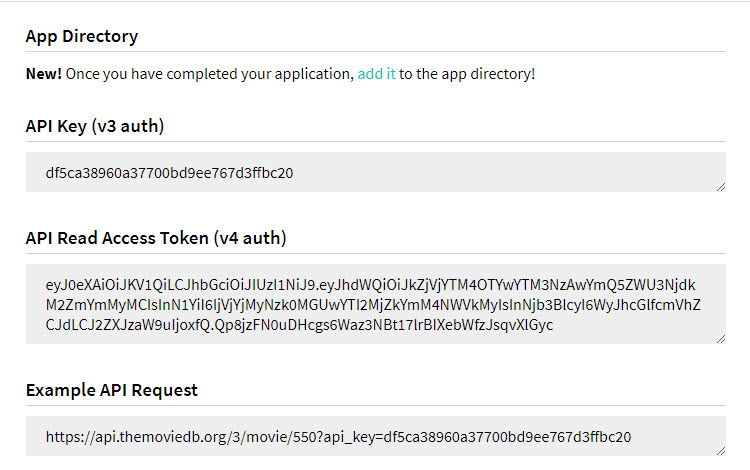

# Retrofit - RecyclerView

## Kemampuan akhir yang diharapkan

Setelah melakukan praktikum ini mahasiswa mampu :

1.	Membuat aplikasi yang memiliki request REST API berupa GET
2.	Mengkonsumsi REST API sederhana menggunakan Retrofit serta menyambungkannya dengan RecyclerView

## Dasar Teori

Retrofit digunakan untuk mempermudah aplikasi android kita mengambil data dari API server. Dengan menggunakan Retrofit kita lebih mudah untuk melakukan request melalui HTTP. Request yang disediakan Retrofit ada lima yaitu GET, POST, PUT, DELETE, dan HEAD.

Untuk menggunakan Retrofit pada aplikasi Android, kita membutuhkan 3 class utama.

**1. Interface yang mendefinisikan operasi HTTP (fungsi atau method)**

Retrofit mengubah HTTP API menjadi Java interface. Berikut ini contoh kode interface dan metode yang dideklarasikan di dalamnya:
```java
public interface GitHubService {
@GET("users/{user}/repos")
Call<List<Repo>> listRepos(@Path("user") String user);
@GET("group/{id}/users")
Call<List<User>> groupList(@Path("id") int groupId);
}
```
Setiap method di dalam interface mewakili sebuah kemungkinan API call, yang harus mempunyai anotasi HTTP (GET, POST, dll) untuk menentukan jenis request dan URL relatif.

Parameter query juga dapat ditambahkan ke dalam method.

```java
@GET(“group/{id}/users”)
Call<List<User>> groupList(@Path(“id”) int groupId, @Query(“sort”) String sort);
```

**2. Class Retrofit yang menghasilkan implementasi interface GitHubService**

Berikut ini contoh kode program di dalam class Retrofit:

```java
Retrofit retrofit = new Retrofit.Builder()
.baseUrl(“https://api.github.com/")
.build();
GitHubService service = retrofit.create(GitHubService.class);
Call<List<Repo>> repos = service.listRepos(“Mahasiswa”);
```

**3. POJO sederhana yang sesuai dengan setiap field dalam objek response JSON yang didapatkan dari permintaan API**

Ini adalah sebuah class sederhana dengan method setter dan getter untuk setiap field.

## Praktikum

Kita akan membuat aplikasi Android yang menggunakan Library Retrofit untuk mengunduh objek JSON yang berisi detail film dari The Movie DB API, yang kemudian detail film akan ditampilkan dalam RecyclerView pada aplikasi Android.

1. Buka website TMDB (www.themoviedb.org). TMDB merupakan website populer untuk mendapatkan informasi tentang film. Situs ini juga menyediakan API REST yang didokumentasikan dengan baik.

2. Lakukan registrasi dan login, kemudian buka www.themoviedb.org/settings/api untuk mendapatkan API key baru.


Dengan menggunakan URL berikut http://api.themoviedb.org/3/movie/top_rated?api_key=MASUKKAN_API_KEY, kita bisa mendapatkan 50 film terakhir. Hal ini bisa kita cek dengan cara memasukkan link tersebut ke browser.



3. Buat project baru dengan Empty Activity.

4. Buka file `build.gradle` dan tambahkan semua pustaka yang akan kita gunakan.

```java
implementation 'com.squareup.picasso:picasso:2.71828'
implementation 'com.squareup.retrofit2:retrofit:2.3.0'
implementation 'com.squareup.retrofit2:converter-gson:2.3.0'
implementation 'com.android.support:recyclerview-v7:27.1.1'
```

Kita menggunakan Picasso untuk memuat URL gambar ke imageView dan menampilkan detail film dalam RecyclerView

5. Karena kita akan melakukan query ke API TMDB sehingga kita perlu menambahkan izin akses internet di dalam file `AndroidManifest.xml`. Sebelum baris kode ```<application ...></application>``` tambahkan kode berikut:

```java
<uses-permission android:name="android.permission.INTERNET" />
```

6. Buat 4 package baru di dalam main pacakage dengan nama **activity**, **adapter**, **model**, dan **rest**. Pindahkan MainActivity yang masih kosong ke dalam package activity.

7. Buat class bernama Movie.java di dalam package model yang merupakan POJO sederhana untuk menampung semua field dan menyediakan method setter dan getter untuk field di objek response JSON. Tambahkan kode berikut di dalam `Movie.java`.

```java
public class Movie {
    @SerializedName("poster_path")
    private String posterPath;
    @SerializedName("adult")
    private boolean adult;
    @SerializedName("overview")
    private String overview;
    @SerializedName("release_date")
    private String releaseDate;
    @SerializedName("genre_ids")
    private List<Integer> genreIds = new ArrayList<Integer>();
    @SerializedName("id")
    private Integer id;
    @SerializedName("original_title")
    private String originalTitle;
    @SerializedName("original_language")
    private String originalLanguage;
    @SerializedName("title")
    private String title;
    @SerializedName("backdrop_path")
    private String backdropPath;
    @SerializedName("popularity")
    private Double popularity;
    @SerializedName("vote_count")
    private Integer voteCount;
    @SerializedName("video")
    private Boolean video;
    @SerializedName("vote_average")
    private Double voteAverage;
    public Movie(String posterPath, boolean adult, String overview, String releaseDate, List<Integer> genreIds, Integer id,
                 String originalTitle, String originalLanguage, String title, String backdropPath, Double popularity,
                 Integer voteCount, Boolean video, Double voteAverage) {
        this.posterPath = posterPath;
        this.adult = adult;
        this.overview = overview;
        this.releaseDate = releaseDate;
        this.genreIds = genreIds;
        this.id = id;
        this.originalTitle = originalTitle;
        this.originalLanguage = originalLanguage;
        this.title = title;
        this.backdropPath = backdropPath;
        this.popularity = popularity;
        this.voteCount = voteCount;
        this.video = video;
        this.voteAverage = voteAverage;
    }
    public String getPosterPath() {
        return posterPath;
    }
    public void setPosterPath(String posterPath) {
        this.posterPath = posterPath;
    }
    public boolean isAdult() {
        return adult;
    }
    public void setAdult(boolean adult) {
        this.adult = adult;
    }
    public String getOverview() {
        return overview;
    }
    public void setOverview(String overview) {
        this.overview = overview;
    }
    public String getReleaseDate() {
        return releaseDate;
    }
    public void setReleaseDate(String releaseDate) {
        this.releaseDate = releaseDate;
    }
    public List<Integer> getGenreIds() {
        return genreIds;
    }
    public void setGenreIds(List<Integer> genreIds) {
        this.genreIds = genreIds;
    }
    public Integer getId() {
        return id;
    }
    public void setId(Integer id) {
        this.id = id;
    }
    public String getOriginalTitle() {
        return originalTitle;
    }
    public void setOriginalTitle(String originalTitle) {
        this.originalTitle = originalTitle;
    }
    public String getOriginalLanguage() {
        return originalLanguage;
    }
    public void setOriginalLanguage(String originalLanguage) {
        this.originalLanguage = originalLanguage;
    }
    public String getTitle() {
        return title;
    }
    public void setTitle(String title) {
        this.title = title;
    }
    public String getBackdropPath() {
        return backdropPath;
    }
    public void setBackdropPath(String backdropPath) {
        this.backdropPath = backdropPath;
    }
    public Double getPopularity() {
        return popularity;
    }
    public void setPopularity(Double popularity) {
        this.popularity = popularity;
    }
    public Integer getVoteCount() {
        return voteCount;
    }
    public void setVoteCount(Integer voteCount) {
        this.voteCount = voteCount;
    }
    public Boolean getVideo() {
        return video;
    }
    public void setVideo(Boolean video) {
        this.video = video;
    }
    public Double getVoteAverage() {
        return voteAverage;
    }
    public void setVoteAverage(Double voteAverage) {
        this.voteAverage = voteAverage;
    }
}
```

8. Kita juga perlu membuat class MovieResponse.java di dalam package model. Class ini berisi semua film yang diambil dan informasi tambahan. Tambahkan kode berikut pada `MovieResponse.java`.

```java
public class MovieResponse {
    @SerializedName("page")
    private int page;
    @SerializedName("results")
    private List<Movie> results;
    @SerializedName("total_results")
    private int totalResults;
    @SerializedName("total_pages")
    private int totalPages;
    public int getPage() {
        return page;
    }
    public void setPage(int page) {
        this.page = page;
    }
    public List<Movie> getResults() {
        return results;
    }
    public void setResults(List<Movie> results) {
        this.results = results;
    }
    public int getTotalResults() {
        return totalResults;
    }
    public void setTotalResults(int totalResults) {
        this.totalResults = totalResults;
    }
    public int getTotalPages() {
        return totalPages;
    }
    public void setTotalPages(int totalPages) {
        this.totalPages = totalPages;
    }
}
```

9. Buat sebuah interface bernama `MovieApiService.java` di dalam package res, kemudian tambahkan kode berikut.

```java

public interface MovieApiService {
    @GET("movie/top_rated")
    Call<MovieResponse> getTopRatedMovies(@Query("api_key") String apiKey);
}
```

10. Buka `colors.xml` dan tambahkan kode berikut.

```java
<?xml version="1.0" encoding="utf-8"?>
<resources>
<color name="colorPrimary">#3F51B5</color>
<color name="colorPrimaryDark">#303F9F</color>
<color name="colorAccent">#FF4081</color>
<color name="orange">#FF3909</color>
<color name="colorAccentDark">#00B482</color>
<color name="colorBlack">#555555</color>
<color name="colorWhite">#FFFFFF</color>
<color name="colorGrey">#707070</color>
<color name="colorGreyLight">#8A8A8A</color>
</resources>
```

11. Buat layout bernama `star.xml` di dalam `/res/drawable/` kemudian tambahkan kode berikut.

```java
<?xml version="1.0" encoding="utf-8"?>
<vector xmlns:android="http://schemas.android.com/apk/res/android"
    android:width="24dp"
    android:height="24dp"
    android:viewportHeight="24"
    android:viewportWidth="24">
    <path android:fillColor="#000"
    android:pathData="M12,17.27L18.18,21L16.54,13.97L22,9.24L14.81,8.62L12,2L9.19,8.62L2,9.24L7.45,13.97L5.82,21L12,17.27Z" />
</vector>
```

12. Buka file `activity_main.xml` dan tambahkan kode berikut.

```java
<?xml version="1.0" encoding="utf-8"?>
<LinearLayout xmlns:android="http://schemas.android.com/apk/res/android"
    xmlns:tools="http://schemas.android.com/tools"
    android:layout_width="match_parent"
    android:layout_height="match_parent"
    tools:context="com.example.asus.retro.activity.MainActivity">
    <android.support.v7.widget.RecyclerView 
        android:id="@+id/recycler_view"
        android:scrollbars="vertical"
        android:layout_width="match_parent"
        android:layout_height="match_parent"/>
</LinearLayout>
```

13. Buat layout baru bernama `list_item_movie.xml` di dalam `/res/layout/`.

```java
<?xml version="1.0" encoding="utf-8"?>
<LinearLayout xmlns:android="http://schemas.android.com/apk/res/android"
    android:id="@+id/movies_layout"
    android:layout_width="match_parent"
    android:layout_height="wrap_content"
    android:gravity="center_vertical"
    android:minHeight="72dp"
    android:orientation="horizontal"
    android:padding="16dp">
    <LinearLayout
    android:layout_width="0dp"
    android:layout_height="wrap_content"
    android:layout_weight="1"
    android:orientation="vertical">
    <ImageView
    android:id="@+id/movie_image"
    android:layout_width="wrap_content"
    android:layout_height="wrap_content"
    android:layout_gravity="top"
    android:paddingRight="16dp"/>
    <TextView
    android:id="@+id/title"
    android:layout_width="wrap_content"
    android:layout_height="wrap_content"
    android:paddingRight="16dp"
    android:textStyle="bold"
    android:textColor="@color/colorBlack"
    android:textSize="16sp" />
    <TextView
    android:id="@+id/date"
    android:layout_width="wrap_content"
    android:layout_height="wrap_content"
    android:paddingRight="16dp"
    android:textColor="@color/colorGreyLight" />
    <TextView
    android:id="@+id/description"
    android:layout_width="wrap_content"
    android:layout_height="wrap_content"
    android:maxLines="3"
    android:paddingRight="16dp"
    android:textColor="@color/colorGreyLight" />
    </LinearLayout>
<LinearLayout
    android:layout_width="wrap_content"
    android:layout_height="35dp"
    android:orientation="horizontal">
    <ImageView
    android:id="@+id/rating_image"
    android:layout_width="15dp"
    android:layout_height="15dp"
    android:layout_centerInParent="true"
    android:scaleType="centerCrop"
    android:src="@drawable/star"
    android:tint="@color/colorAccent" />
    <TextView
    android:id="@+id/rating"
    android:layout_width="wrap_content"
    android:layout_height="wrap_content"
    android:layout_marginLeft="8dp"
    android:text="5.0" />
    </LinearLayout>
</LinearLayout>
```

15. Adapter berfungsi untuk mengikat tampilan dan data. Buat class bernama `MoviesAdapter.java` di dalam package adapter.

```java
public class MoviesAdapter extends RecyclerView.Adapter<MoviesAdapter.MovieViewHolder> {
    private List<Movie> movies;
    private int rowLayout;
    private Context context;
    public static final String IMAGE_URL_BASE_PATH="http://image.tmdb.org/t/p/w342//";
    public MoviesAdapter(List<Movie> movies, int rowLayout, Context context) {
        this.movies = movies;
        this.rowLayout = rowLayout;
        this.context = context;
    }
    //View holder
    public static class MovieViewHolder extends RecyclerView.ViewHolder {
        LinearLayout moviesLayout;
        TextView movieTitle;
        TextView data;
        TextView movieDescription;
        TextView rating;
        ImageView movieImage;
        public MovieViewHolder(View v) {
            super(v);
            moviesLayout = (LinearLayout) v.findViewById(R.id.movies_layout);
            movieImage = (ImageView) v.findViewById(R.id.movie_image);
            movieTitle = (TextView) v.findViewById(R.id.title);
            data = (TextView) v.findViewById(R.id.date);
            movieDescription = (TextView) v.findViewById(R.id.description);
            rating = (TextView) v.findViewById(R.id.rating);
        }
    }
    @Override
    public MoviesAdapter.MovieViewHolder onCreateViewHolder(ViewGroup parent,
                                                            int viewType) {
        View view = LayoutInflater.from(parent.getContext()).inflate(rowLayout, parent, false);
        return new MovieViewHolder(view);
    }
    @Override
    public void onBindViewHolder(MovieViewHolder holder, final int position) {
        String image_url = IMAGE_URL_BASE_PATH + movies.get(position).getPosterPath();
        Picasso.get()
                .load(image_url)
                .placeholder(android.R.drawable.sym_def_app_icon)
                .error(android.R.drawable.sym_def_app_icon)
                .into(holder.movieImage);
        holder.movieTitle.setText(movies.get(position).getTitle());
        holder.data.setText(movies.get(position).getReleaseDate());
        holder.movieDescription.setText(movies.get(position).getOverview());
        holder.rating.setText(movies.get(position).getVoteAverage().toString());
    }
    @Override
    public int getItemCount() {
        return movies.size();
    }
}
```

16. Class MainActivity.java merupakan activity dimana kita membuat request ke API Movie DB. Buka `MainActivity.java` dan tambahkan kode berikut. **Jangan lupa isikan API key sesuai dengan API key yang sudah didapatkan sebelumnya.**

```java
public class MainActivity extends AppCompatActivity{
    private static final String TAG = MainActivity.class.getSimpleName();
    public static final String BASE_URL = "http://api.themoviedb.org/3/";
    private static Retrofit retrofit = null;
    private RecyclerView recyclerView = null;
    // Masukkan API key themoviedb.org API KEY di bawah ini
    private final static String API_KEY = "";
    @Override
    protected void onCreate(Bundle savedInstanceState) {
        super.onCreate(savedInstanceState);
        setContentView(R.layout.activity_main);
        recyclerView = (RecyclerView) findViewById(R.id.recycler_view);
        recyclerView.setHasFixedSize(true);
        recyclerView.setLayoutManager(new LinearLayoutManager(this));
        connectAndGetApiData();
    }
    
    public void connectAndGetApiData(){
        if (retrofit == null) {
            retrofit = new Retrofit.Builder()
                    .baseUrl(BASE_URL)
                    .addConverterFactory(GsonConverterFactory.create())
                    .build();
        }
        MovieApiService movieApiService = retrofit.create(MovieApiService.class);
        Call<MovieResponse> call = movieApiService.getTopRatedMovies(API_KEY);
        call.enqueue(new Callback<MovieResponse>() {
            @Override
            public void onResponse(Call<MovieResponse> call, Response<MovieResponse> response) {
                List<Movie> movies = response.body().getResults();
                recyclerView.setAdapter(new MoviesAdapter(movies, R.layout.list_item_movie, getApplicationContext()));
                Log.d(TAG, "Jumlah film: " + movies.size());
            }
            @Override
            public void onFailure(Call<MovieResponse> call, Throwable throwable) {
                Log.e(TAG, throwable.toString());
            }
        });
    }
}
```

17. Jalankan program dan amati hasilnya.

## Tugas

